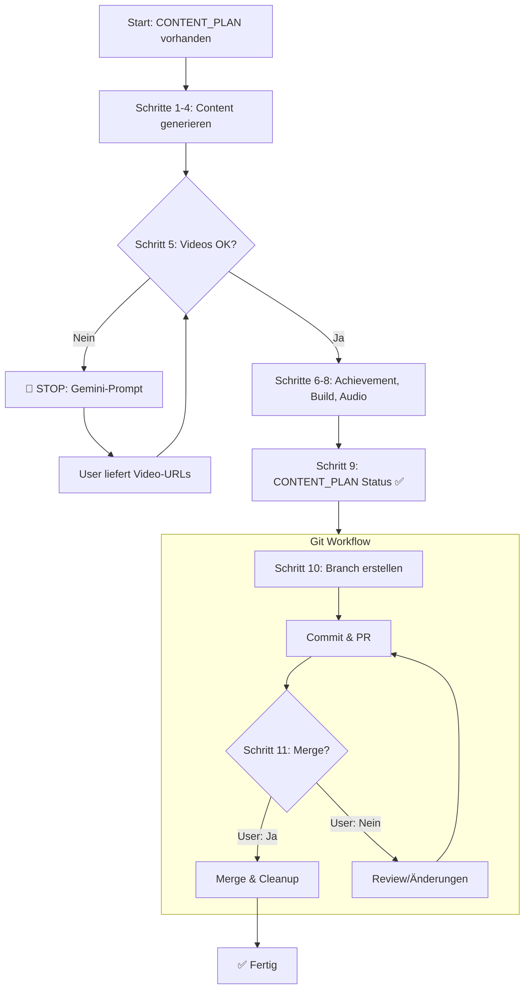

# Content Generation

Inhalte aus CONTENT_PLAN generieren – **automatisierter Workflow mit definierten Stop-Go Points**.

## Überblick: 10-Schritte-Workflow

```text
Schritt 1: Zielordner & CONTENT_PLAN lesen
Schritt 2: lecture.md erstellen
Schritt 3: lecture-items/ erstellen
Schritt 4: questions/ erstellen
Schritt 5: Videos verifizieren          ← 🛑 STOP: Gemini für fehlende Videos!
Schritt 6: Achievement erstellen
Schritt 7: Build & Validierung
Schritt 8: Audio-Generierung
Schritt 9: CONTENT_PLAN Status-Update   ← Im studies-material/
Schritt 10: Branch, Commit & PR         ← Git
Schritt 11: Merge nach Approval         ← 🛑 STOP: User-Bestätigung!
```

### Stop-Go Points (manuelle Eingriffe nötig)

| Schritt | Grund                  | Aktion                            |
| ------- | ---------------------- | --------------------------------- |
| **5**   | Videos nicht verfügbar | User muss Gemini-Prompt verwenden |
| **11**  | Merge-Approval         | User muss explizit bestätigen     |

Alle anderen Schritte laufen automatisch durch!

## Prozess-Visualisierung



## Schritt 1: Zielordner & CONTENT_PLAN

### Zielordner ermitteln

⚠️ **KRITISCH:** Ordnernamen in `content/` und `studies-material/` können unterschiedlich sein!

```bash
# ZUERST content-Ordner prüfen:
list_dir content/{studyId}/

# Beispiel:
# studies-material/.../02-grundlagen-chemie/ 
# → content/.../02-chemie-grundlagen/  (ANDERER NAME!)
```

### CONTENT_PLAN.md lesen

```bash
# Im Material-Ordner:
studies-material/{studyId}/NN-modul/NN-vorlesung/CONTENT_PLAN.md
```

Der Plan definiert:

- Exakte Dateinamen (`01-einleitung.md`, `02-mc-test.md`, ...)
- Content-Types pro Datei
- Didaktische Reihenfolge

### Zusätzliche Ressourcen prüfen

**Im Modul-Ordner:**

- `overview.md` – Modulziele, Prüfungsmodalitäten
- `mortimer-questions.md` – Fachliteratur-Fragen

**Im Vorlesungs-Ordner:**

- `Vorlesung.md` – Hauptinhalt mit Zitationen
- `Videos.md` – Bereits verifizierte YouTube-Videos (falls vorhanden)

## Schritt 2: lecture.md erstellen

```yaml
---
topic: 'Periodensystem der Elemente'
description: 'Aufbau und Struktur des Periodensystems'
estimatedTime: 90
version: '1.0.0'
sources:
  - id: 'vorlesung-folien'
    title: 'Vorlesungsfolien Kapitel 1'
    url: 'https://moodle.univie.ac.at/...'
    type: 'pdf'
  - id: 'mortimer-kap1'
    title: 'Mortimer: Chemie (Kap. 1)'
    type: 'book'
---
```

## Schritt 3: lecture-items/ erstellen

Für jeden Eintrag im CONTENT_PLAN:

1. Datei mit exaktem Namen erstellen
2. Korrekten Content-Type verwenden
3. `sourceRefs` hinzufügen wenn Zitationen vorhanden

### Zitationen verarbeiten

**Eingabe (Vorlesung.md):**

```markdown
Die Ionenbindung entsteht durch Elektronenübertragung [cite_start]zwischen 
Metall und Nichtmetall[cite: 12-15].
```

**Ausgabe (lecture-item):**

```yaml
---
type: 'learning-content'
sourceRefs:
  - sourceId: 'vorlesung-folien'
    pages: '12-15'
---

Die Ionenbindung entsteht durch Elektronenübertragung zwischen 
Metall und Nichtmetall.
```

### Content-Struktur V4

Jeder Abschnitt folgt: **Lernen → Überprüfen → Anwenden**

```text
ABSCHNITT
├── 📚 learning-content      (Theorie)
├── ✅ self-assessment-mc    (Verständnis-Check)
├── ✅ fill-in-the-blank     (Lückentext)
├── ✅ matching              (Zuordnung)
├── 🧮 calculation           (Berechnung)
├── 🧮 practice-exercise     (Praxis)
└── 📺 youtube-video         (an passender Stelle!)

VORLESUNGS-ENDE
├── 📋 self-assessment       (Bereitschafts-Checkliste)
├── 📝 questions/            (12 schwere MC-Multiple)
└── 🎓 module-exam/          (2 Transferfragen)
```

⚠️ Videos NICHT am Ende sammeln – an thematisch passender Stelle!

## Schritt 4: questions/ erstellen

Nur `multiple-choice-multiple` für Vorlesungs-Tests!

```yaml
---
type: 'multiple-choice-multiple'
question: 'Welche Aussagen zur Ionenbindung sind korrekt?'
options:
  - 'Ionenbindungen entstehen durch Elektronenübertragung'
  - 'Ionenbindungen sind gerichtet'
  - 'Ionenverbindungen leiten als Schmelze Strom'
  - 'Ionenbindungen entstehen nur zwischen Metallen'
correctAnswers:
  - 'Ionenbindungen entstehen durch Elektronenübertragung'
  - 'Ionenverbindungen leiten als Schmelze Strom'
explanation: 'Ionenbindungen sind ungerichtet und entstehen zwischen Metallen und Nichtmetallen.'
---
```

**Anzahl:** 12 Fragen pro Vorlesung

## Schritt 5: Videos verifizieren

⚠️ **KRITISCH:** Alle YouTube-Videos MÜSSEN vor dem Abschluss verifiziert werden!

### Video-Validierung ausführen

**IMMER das Batch-Script verwenden – NIEMALS manuelle curl-Befehle!**

```bash
# Nach Erstellung der Video-Items das Script ausführen:
npm run validate:videos

# Für spezifische Vorlesung (prüft alle Videos im Studium):
node scripts/validate-videos.js bsc-ernaehrungswissenschaften
```

Das Script:
- Findet automatisch alle `youtube-video` Items
- Prüft jede URL via oEmbed API
- Erkennt simpleclub-Videos (Blacklist)
- Gibt klare Zusammenfassung mit ✅/❌ Status

### Ergebnis-Interpretation

| Status            | Bedeutung               | Aktion                  |
| ----------------- | ----------------------- | ----------------------- |
| ✅ Verfügbar       | oEmbed HTTP 200         | Behalten                |
| ❌ Nicht verfügbar | HTTP 401/403/404        | Ersetzen oder entfernen |
| ⚠️ simpleclub      | Embedding oft blockiert | Im Browser testen       |

### Falls Videos nicht verifiziert werden können

Wenn Videos ersetzt werden müssen, diesen **Gemini-Prompt** verwenden:

```text
Ich brauche deutsche YouTube-Videos für eine universitäre Chemie-Vorlesung zum Thema "[THEMA]".

Zielgruppe: Studierende im 1. Semester Ernährungswissenschaften (Universität Wien)

Benötigte Themen:
1. [Thema 1] - [Kurzbeschreibung]
2. [Thema 2] - [Kurzbeschreibung]
[...]

BLACKLIST - Diese Kanäle NICHT verwenden (blockieren Embedding):
- simpleclub (author_name enthält "simpleclub")

Bevorzugte Kanäle (Whitelist):
- Lehrerschmidt
- Die Merkhilfe
- musstewissen Chemie
- StudyTiger

KRITISCH: oEmbed-Verifizierung
Für jedes Video die API aufrufen:
https://www.youtube.com/oembed?url=https://www.youtube.com/watch?v=VIDEO_ID&format=json

- HTTP 200 + JSON = verwendbar
- Prüfe author_name auf "simpleclub" - wenn enthalten, ABLEHNEN!

Ausgabeformat als YAML:
- thema: "1. [Thema]"
  titel: "[Videotitel aus oEmbed]"
  url: "https://www.youtube.com/watch?v=..."
  kanal: "[author_name aus oEmbed]"
  oembed_verified: true
```

> ✅ **Nachfragen:** "Videos verifiziert. X von Y funktionieren. Soll ich das Achievement erstellen?"

## Schritt 6: Achievement erstellen

Jede Vorlesung sollte ein **Cheat-Sheet Achievement** haben, das bei Gold-Status im Quiz freigeschaltet wird.

### Achievement-Struktur

Datei: `content/{studyId}/NN-modul/achievements/NN-vorlesung-cheatsheet.md`

```yaml
---
type: 'achievement'
id: 'vorlesung-titel-cheatsheet'
title: 'Vorlesung Titel Cheat-Sheet'
description: 'Kompakte Übersicht zum Thema X'
icon: 'clipboard'
contentType: 'markdown'
unlockCondition:
  type: 'lecture-quiz-gold'
  lectureId: 'NN-vorlesung-id'
  moduleId: 'NN-modul-id'
defaultDuration: 30
extensionDuration: 14
warningThreshold: 7
---

# Thema: Cheat-Sheet

Herzlichen Glückwunsch! Du hast das Quiz mit Gold-Status bestanden.

***

## Wichtige Konzepte

[Kompakte Zusammenfassung der Kernkonzepte]

## Formeln

[Wichtigste Formeln]

## Merkregeln

[Eselsbrücken, Tipps]
```

### Achievement-Checkliste

- [ ] `id` ist eindeutig (lowercase, kebab-case)
- [ ] `lectureId` und `moduleId` stimmen exakt mit Ordnernamen überein
- [ ] `icon` ist gültig (siehe content-types.md)
- [ ] Inhalt ist kompakt und nützlich als Nachschlagewerk
- [ ] Keine zu langen Tabellen (Mobile-Darstellung!)

## Schritt 7: Build & Validierung

```bash
# 1. JSON regenerieren
npm run build

# 2. Content-Struktur prüfen
npm run validate:content

# 3. Videos nochmals prüfen
npm run validate:videos

# 4. Markdown linten
npx markdownlint-cli2 "content/{path}/**/*.md"

# 5. Testdaten regenerieren
node scripts/generate-test-progress.js
```

### Validierungs-Checkliste

- [ ] Build ohne Fehler
- [ ] validate:content ohne Fehler
- [ ] validate:videos alle ✅
- [ ] markdownlint ohne Fehler
- [ ] Im Browser getestet (Tools → Inhalte validieren)

## Schritt 8: Audio-Generierung

Audio-Dateien ergänzen `learning-content` Items für barrierefreies Lernen.

### Audio-Scripts erstellen

Für jedes `learning-content` Item ein `.audio.txt` Script erstellen:

```text
content/.../lecture-items/
├── 01-learning-einfuehrung.md
├── 01-learning-einfuehrung.audio.txt  ← Script (Plain Text!)
└── 01-learning-einfuehrung.mp3        ← Wird generiert
```

**Format-Regeln für Audio-Scripts:**

- Plain Text, KEIN Markdown!
- Keine `#`, `**`, `-` Syntax
- Formeln ausschreiben: `$H_2O$` → "H zwei O"
- Pausen mit `...` (keine SSML-Tags)
- Max. 2-3 Minuten pro Script

### MP3s generieren

```bash
# Für eine Vorlesung
npm run generate:audio -- --lecture NN --force

# Für ein Modul
npm run generate:audio -- --module NN --force

# Dry-Run (zeigt was generiert würde)
npm run generate:audio -- --dry-run
```

### Nach Audio-Generierung

```bash
npm run build  # Registriert audioFile in Bundles
```

> ✅ **Abschluss:** "Audio-Dateien generiert. Weiter mit Git-Workflow."

## Schritt 9: CONTENT_PLAN Status-Update

**VOR dem Git-Workflow** den CONTENT_PLAN im `studies-material/` Ordner aktualisieren:

```markdown
## Status

| Schritt            | Status | Datum      | Details             |
| ------------------ | ------ | ---------- | ------------------- |
| Content generiert  | ✅      | 2026-01-25 | 37 Items, 12 Fragen |
| Videos verifiziert | ✅      | 2026-01-25 | 3/4 funktionieren   |
| Audio generiert    | ✅      | 2026-01-25 | 16 MP3s             |
| PR gemerged        | ⏳      | -          | -                   |
```

> **Hinweis:** `PR gemerged` bleibt auf ⏳ bis der Merge erfolgt ist.

## Schritt 10: Branch, Commit & PR

### 10.1 Branch erstellen

```bash
# Auf main wechseln und aktualisieren
git checkout main
git pull

# Feature-Branch erstellen
git checkout -b content/NN-vorlesung-titel
# Beispiel: content/16-chemisches-gleichgewicht
```

### 10.2 Atomic Commits erstellen

```bash
# Alle Änderungen prüfen
git status

# Atomic Commits nach Komponente
git add content/{path}/lecture.md
git commit -m "content: add lecture metadata for [Vorlesung]"

git add content/{path}/lecture-items/
git commit -m "content: add lecture items for [Vorlesung]"

git add content/{path}/questions/
git commit -m "content: add quiz questions for [Vorlesung]"

git add content/{path}/../achievements/
git commit -m "content: add achievement for [Vorlesung]"

# Oder: Ein kombinierter Commit für die gesamte Vorlesung
git add content/{path}/
git add content/{path}/../achievements/*-{vorlesung}*.md
git commit -m "content: add complete [Vorlesung] lecture"
```

### 10.2 Push & PR erstellen

```bash
# Branch pushen
git push -u origin content/NN-vorlesung-titel

# PR erstellen mit GitHub CLI
gh pr create \
  --title "content: add [Vorlesung Titel] lecture" \
  --body "## Neue Vorlesung: [Titel]

### Erstellt
- [ ] lecture.md mit Metadaten
- [ ] XX lecture-items (learning-content, MC, etc.)
- [ ] 12 Quiz-Fragen
- [ ] X YouTube-Videos (verifiziert)
- [ ] Achievement/Cheat-Sheet
- [ ] XX Audio-Dateien

### Validierung
- [ ] \`npm run build\` erfolgreich
- [ ] \`npm run validate:content\` ohne Fehler
- [ ] \`npm run validate:videos\` alle ✅
- [ ] Browser-Test bestanden" \
  --assignee @me
```

> ✅ **Nachfragen:** "PR erstellt: [PR-URL]. Soll ich nach Review mergen?"

## Schritt 11: Merge nach Approval

⚠️ **STOP-POINT:** Immer auf explizite User-Bestätigung warten!

```bash
# Nach User-Approval:
gh pr merge --squash --delete-branch

# Zurück zu main
git checkout main
git pull
```

### 11.1 CONTENT_PLAN Status-Update

Nach erfolgreichem Merge den CONTENT_PLAN im `studies-material/` Ordner aktualisieren:

```markdown
## Status

| Schritt            | Status | Datum      | Details             |
| ------------------ | ------ | ---------- | ------------------- |
| Content generiert  | ✅      | 2026-01-25 | 37 Items, 12 Fragen |
| Videos verifiziert | ✅      | 2026-01-25 | 3/4 funktionieren   |
| Audio generiert    | ✅      | 2026-01-25 | 16 MP3s             |
| PR gemerged        | ✅      | 2026-01-25 | PR #123             |
```

> ✅ **Abschluss:** "Vorlesung [Titel] wurde erfolgreich gemerged und CONTENT_PLAN aktualisiert!"

## Lecture Versioning

```text
PATCH  1.0.0 → 1.0.1   Typos, Formatierung
MINOR  1.0.0 → 1.1.0   Inhalt substantiell geändert
MAJOR  1.0.0 → 2.0.0   Komplett neu generiert
```

## Quick Reference: Alle Schritte

| Schritt | Beschreibung        | Befehl/Aktion                       |
| ------- | ------------------- | ----------------------------------- |
| 1       | Zielordner & Plan   | `list_dir`, CONTENT_PLAN.md lesen   |
| 2       | lecture.md          | Metadaten erstellen                 |
| 3       | lecture-items/      | Alle Items gemäß Plan               |
| 4       | questions/          | 12 MC-Multiple Fragen               |
| 5       | Videos verifizieren | `npm run validate:videos`           |
| 6       | Achievement         | Cheat-Sheet erstellen               |
| 7       | Build & Validate    | `npm run build` + Testdaten         |
| 8       | Audio               | Scripts + `npm run generate:audio`  |
| 9       | CONTENT_PLAN Status | Status-Update im studies-material/  |
| 10      | Branch, Commit & PR | `gh pr create --assignee @me`       |
| 11      | Merge               | `gh pr merge` (nach User-OK!)       |

## Siehe auch

- [content-types.md](content-types.md) – YAML-Referenz aller Types
- [content-verification.md](content-verification.md) – Vollständigkeits-Prüfung
- [audio-workflow.md](audio-workflow.md) – Audio-Details
- [video-workflow.md](video-workflow.md) – Video-Suche mit Gemini
