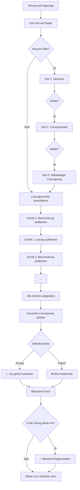

# Konzept: Modul-Training Erweiterung – Praktische Übungen & Blueprints

**Status:** ✅ Approved – Ready for Implementation  
**Erstellt:** 2026-01-31  
**Autor:** Copilot + Roland  
**Review:** 2026-01-31 – Entscheidungen getroffen

---

## 1. Übersicht

### Ziel

Das Modul-Training wird um **praktische Übungen** erweitert, bei denen Studierende Berechnungen und chemische Gleichungen auf Papier lösen. Zusätzlich wird ein neues Achievement-System **Blueprints** eingeführt.

### Aktuelle Situation

```text
Modul-Training (IST)
├── Multiple-Choice-Fragen
│   ├── 15 Kapitel × 5 Level × 10 Fragen = 750 Fragen
│   └── Automatische Bewertung
└── Keine praktischen Übungen
```

### Ziel-Situation

```text
Modul-Training (SOLL)
├── Multiple-Choice-Fragen (unverändert)
│   ├── 15 Kapitel × 5 Level × 10 Fragen = 750 Fragen
│   └── Automatische Bewertung
│
├── Praktische Übungen (NEU)
│   ├── Bis zu 10 Übungen pro Kapitel (wo sinnvoll)
│   ├── 5 Schwierigkeitsstufen (wie bei MC-Fragen)
│   ├── Schrittweises Aufdecken des Lösungswegs
│   └── Selbstkontrolle (richtig/falsch)
│
├── Blueprints (NEU)
│   ├── Lösungsweg-Templates für Aufgabentypen
│   ├── Werden bei erster gelöster Übung freigeschaltet
│   ├── Zeitbegrenzt (wie Cheatsheets)
│   └── Verlängerung mit Tokens oder erneutes Lösen einer Übung
│
└── Trainings-Modus-Einstellungen (NEU)
    ├── Nur MC-Fragen
    ├── Nur Übungen
    └── Beides (Standard)
```

---

## 2. Praktische Übungen – User Experience

### 2.1 Flow-Übersicht



### 2.2 UI-Mockup: Übungs-Ansicht

```text
┌─────────────────────────────────────────────────────────────┐
│ Kapitel 3: Stöchiometrie          Übung 2/10          [📋] │
├─────────────────────────────────────────────────────────────┤
│                                                             │
│ ┌─────────────────────────────────────────────────────────┐ │
│ │ 📝 AUFGABE                                              │ │
│ │                                                         │ │
│ │ Bei der vollständigen Verbrennung von 12,0 g Kohlenstoff│ │
│ │ mit Sauerstoff entsteht Kohlendioxid.                   │ │
│ │                                                         │ │
│ │ Berechne:                                               │ │
│ │ a) Die Stoffmenge an Kohlenstoff                        │ │
│ │ b) Die benötigte Masse an Sauerstoff                    │ │
│ │ c) Die entstehende Masse an CO₂                         │ │
│ └─────────────────────────────────────────────────────────┘ │
│                                                             │
│ ┌─────────────────────────────────────────────────────────┐ │
│ │ 💡 HILFEN                                               │ │
│ │                                                         │ │
│ │ [Stichwort zeigen] [Ansatz zeigen] [Lösungsweg zeigen]  │ │
│ │        ○               ○                 ○              │ │
│ └─────────────────────────────────────────────────────────┘ │
│                                                             │
│ ┌─────────────────────────────────────────────────────────┐ │
│ │ ✅ SCHRITTE KONTROLLIEREN                               │ │
│ │                                                         │ │
│ │ Schritt 1: [Beschreibung aufdecken]                     │ │
│ │ Schritt 2: [gesperrt - vorherigen Schritt erst zeigen]  │ │
│ │ Schritt 3: [gesperrt]                                   │ │
│ │ Schritt 4: [gesperrt]                                   │ │
│ └─────────────────────────────────────────────────────────┘ │
│                                                             │
│ ┌─────────────────────────────────────────────────────────┐ │
│ │ 📚 RESSOURCEN (optional)                                │ │
│ │                                                         │ │
│ │ [🔒 Stöchiometrie Cheat-Sheet] [📘 Mol-Konzept Blueprint]│ │
│ └─────────────────────────────────────────────────────────┘ │
│                                                             │
└─────────────────────────────────────────────────────────────┘
```

### 2.3 UI-Mockup: Schrittweise Kontrolle (aufgedeckt)

```text
┌─────────────────────────────────────────────────────────────┐
│ ✅ SCHRITTE KONTROLLIEREN                                   │
│                                                             │
│ ┌─────────────────────────────────────────────────────────┐ │
│ │ Schritt 1: Reaktionsgleichung aufstellen                │ │
│ │ ─────────────────────────────────────────────           │ │
│ │ C + O₂ → CO₂                                            │ │
│ └─────────────────────────────────────────────────────────┘ │
│                                                             │
│ ┌─────────────────────────────────────────────────────────┐ │
│ │ Schritt 2: Stoffmenge von Kohlenstoff berechnen         │ │
│ │ ─────────────────────────────────────────────           │ │
│ │ n(C) = m/M = 12,0 g / 12,0 g/mol = 1,0 mol              │ │
│ └─────────────────────────────────────────────────────────┘ │
│                                                             │
│ ┌─────────────────────────────────────────────────────────┐ │
│ │ Schritt 3: [Beschreibung aufdecken ▼]                   │ │
│ └─────────────────────────────────────────────────────────┘ │
│                                                             │
│ ┌─────────────────────────────────────────────────────────┐ │
│ │ Schritt 4: [gesperrt 🔒]                                │ │
│ └─────────────────────────────────────────────────────────┘ │
│                                                             │
└─────────────────────────────────────────────────────────────┘
```

### 2.4 UI-Mockup: Selbstkontrolle am Ende

```text
┌─────────────────────────────────────────────────────────────┐
│                                                             │
│            Vergleiche deine Lösung mit dem                  │
│                 vollständigen Lösungsweg                    │
│                                                             │
│  ┌────────────────────────────────────────────────────────┐ │
│  │ Stimmt deine Lösung überein?                           │ │
│  │                                                        │ │
│  │   [ ✅ Ja, korrekt gelöst ]   [ ❌ Nein, Fehler ]      │ │
│  │                                                        │ │
│  └────────────────────────────────────────────────────────┘ │
│                                                             │
│  ℹ️ Bei "Nein" wird diese Übung später nochmals vorgelegt.  │
│                                                             │
└─────────────────────────────────────────────────────────────┘
```

---

## 3. Hint-System

### 3.1 Drei Hint-Stufen

| Stufe | Name       | Inhalt                         | Beispiel                                                        |
| ----- | ---------- | ------------------------------ | --------------------------------------------------------------- |
| 1     | Stichwort  | Ein Begriff zur Orientierung   | "Stöchiometrie: Stoffmengenverhältnis"                          |
| 2     | Ansatz     | Beginn des Lösungswegs         | "Zuerst die Reaktionsgleichung aufstellen, dann n=m/M anwenden" |
| 3     | Lösungsweg | Vollständige Schritt-Übersicht | Alle Schritte als Liste (ohne Details)                          |

### 3.2 Hint-Logik

- Hints können in beliebiger Reihenfolge aufgedeckt werden
- Bereits aufgedeckte Hints bleiben sichtbar
- Hints haben **keinen Einfluss** auf die Selbstkontrolle (nur User entscheidet)

---

## 4. Datenstruktur

### 4.1 Übungs-Format (YAML)

```yaml
# exercises.yaml (im Kapitel-Ordner)
topic: 'Chemische Gleichungen & Stöchiometrie'
blueprintType: 'stoichiometry-calculation'  # Verknüpfung zum Blueprint
exercises:
  - id: 'ex-03-01'
    title: 'Verbrennung von Kohlenstoff'
    level: 3  # 1-5, analog zu MC-Levels (Schwierigkeitsstufe)
    
    task: |
      Bei der vollständigen Verbrennung von 12,0 g Kohlenstoff
      mit Sauerstoff entsteht Kohlendioxid.
      
      Berechne:
      a) Die Stoffmenge an Kohlenstoff
      b) Die benötigte Masse an Sauerstoff
      c) Die entstehende Masse an CO₂
    
    hints:
      keyword: 'Stoffmengenverhältnis aus Reaktionsgleichung'
      approach: |
        1. Reaktionsgleichung aufstellen
        2. Stoffmengen über n = m/M berechnen
        3. Stöchiometrische Verhältnisse anwenden
      overview: |
        - Reaktionsgleichung: C + O₂ → CO₂
        - n(C) = 1,0 mol
        - n(O₂) = 1,0 mol → m(O₂) = 32,0 g
        - n(CO₂) = 1,0 mol → m(CO₂) = 44,0 g
    
    steps:
      - description: 'Reaktionsgleichung aufstellen'
        solution: 'C + O₂ → CO₂'
        
      - description: 'Stoffmenge von Kohlenstoff berechnen (n = m/M)'
        solution: 'n(C) = 12,0 g / 12,0 g/mol = 1,0 mol'
        
      - description: 'Stoffmenge O₂ aus stöchiometrischem Verhältnis (1:1)'
        solution: 'n(O₂) = 1,0 mol'
        
      - description: 'Masse des Sauerstoffs berechnen (m = n × M)'
        solution: 'm(O₂) = 1,0 mol × 32,0 g/mol = 32,0 g'
        
      - description: 'Stoffmenge CO₂ aus stöchiometrischem Verhältnis (1:1)'
        solution: 'n(CO₂) = 1,0 mol'
        
      - description: 'Masse des Kohlendioxids berechnen'
        solution: 'm(CO₂) = 1,0 mol × 44,0 g/mol = 44,0 g'
    
    finalAnswer: |
      a) n(C) = 1,0 mol
      b) m(O₂) = 32,0 g
      c) m(CO₂) = 44,0 g
    
    relatedCheatsheets:
      - 'stoechiometrie-cheatsheet'
      - 'mol-konzept-cheatsheet'

  - id: 'ex-03-02'
    title: 'Reaktion von Magnesium mit Salzsäure'
    # ... weitere Übung
```

### 4.2 Übungs-Level-Definitionen

| Level | Komplexität   | Schritte | Beispiel                             |
| ----- | ------------- | -------- | ------------------------------------ |
| 1     | Grundlegend   | 2-3      | Einfache n=m/M Berechnung            |
| 2     | Einfach       | 3-4      | Mol-Berechnung mit Umrechnung        |
| 3     | Mittel        | 4-5      | Stöchiometrie mit Reaktionsgleichung |
| 4     | Komplex       | 5-7      | Mehrstufige Reaktion, Ausbeute       |
| 5     | Anspruchsvoll | 6-8+     | Transfer, unbekannte Kontexte        |

### 4.3 Ordner-Struktur

```text
content/{studyId}/{moduleId}/module-training/
├── training.md
├── training-bundle.json                    # Erweitert um Übungen
├── 01-aufbau-atome-periodensystem/
│   ├── level-1.yaml ... level-5.yaml
│   └── (keine exercises.yaml - Faktenwissen)
├── 02-elemente-ionen-mol/
│   ├── level-1.yaml ... level-5.yaml
│   └── exercises.yaml                      # 2 Übungen pro Level = 10 total
├── 03-gleichungen-stoechiometrie/
│   ├── level-1.yaml ... level-5.yaml
│   └── exercises.yaml                      # Kernthema: 2 Übungen pro Level
└── ...
```

### 4.3 Kapitel mit/ohne Übungen

| Kapitel | Name                          | Übungen sinnvoll? | Begründung                     |
| ------- | ----------------------------- | ----------------- | ------------------------------ |
| 01      | Aufbau Atome & Periodensystem | ❌ Nein            | Faktenwissen, keine Rechnung   |
| 02      | Elemente, Ionen & Mol         | ✅ Ja (5-10)       | Mol-Berechnungen               |
| 03      | Gleichungen & Stöchiometrie   | ✅ Ja (10)         | Kernthema für Berechnungen     |
| 04      | Reaktionen & Formeln          | ✅ Ja (5-10)       | Empirische Formeln berechnen   |
| 05      | Lösungen & Konzentrationen    | ✅ Ja (10)         | Verdünnungsrechnungen          |
| 06      | Säuren & Basen (Grundlagen)   | ⚠️ Wenige (3-5)    | Einfache Neutralisation        |
| 07      | Bohr & Elektronenkonfig.      | ⚠️ Wenige (3-5)    | Konfigurationen schreiben      |
| 08      | Ionenbindung & Lewis          | ⚠️ Wenige (3-5)    | Lewis-Strukturen zeichnen      |
| 09      | Polarität & VSEPR             | ⚠️ Wenige (3-5)    | Geometrie bestimmen            |
| 10      | Hybridisierung & MO           | ⚠️ Wenige (3-5)    | Bindungsordnung berechnen      |
| 11      | Thermodynamik & Enthalpie     | ✅ Ja (10)         | Hess, Enthalpie-Berechnungen   |
| 12      | Aggregatzustände & Phasen     | ⚠️ Wenige (3-5)    | Clausius-Clapeyron             |
| 13      | Kolligative Eigenschaften     | ✅ Ja (10)         | Berechnungen ΔT, Osmose        |
| 14      | Säuren & Basen (Fortg.)       | ✅ Ja (10)         | pH, pKs, Henderson-Hasselbalch |
| 15      | Elektrochemie & Redox         | ✅ Ja (10)         | Nernst, Faraday                |

---

## 5. Blueprints (Neues Achievement)

### 5.1 Was ist ein Blueprint?

Ein **Blueprint** ist eine detaillierte Anleitung für einen bestimmten Aufgabentyp:

- Erklärt den allgemeinen Lösungsweg
- Enthält ein durchgerechnetes Musterbeispiel
- Listet häufige Fehler und Tipps auf
- Kann bei MC-Fragen und Übungen als Ressource angezeigt werden

### 5.2 Blueprint-Typen (Beispiele)

| Blueprint-ID                | Titel                         | Freigeschaltet durch       |
| --------------------------- | ----------------------------- | -------------------------- |
| `mol-calculation`           | Mol-Berechnungen              | Erste Mol-Übung gelöst     |
| `stoichiometry-calculation` | Stöchiometrische Berechnungen | Erste Stöchiometrie-Übung  |
| `concentration-calculation` | Konzentrationsberechnungen    | Erste Verdünnungs-Übung    |
| `ph-calculation`            | pH-Wert-Berechnungen          | Erste pH-Übung             |
| `buffer-calculation`        | Puffer-Berechnungen           | Erste Puffer-Übung         |
| `enthalpy-calculation`      | Enthalpie-Berechnungen        | Erste Hess-Übung           |
| `nernst-calculation`        | Nernst-Gleichung anwenden     | Erste Elektrochemie-Übung  |
| `lewis-structure`           | Lewis-Strukturen zeichnen     | Erste Lewis-Übung          |
| `electron-configuration`    | Elektronenkonfiguration       | Erste Konfigurations-Übung |

### 5.3 Blueprint-Format (Markdown)

```yaml
---
type: 'achievement'
achievementType: 'blueprint'           # NEU: Unterscheidung von cheatsheet
id: 'stoichiometry-calculation-blueprint'
title: 'Stöchiometrie Blueprint'
description: 'Systematischer Lösungsweg für stöchiometrische Berechnungen'
icon: 'beaker'                         # oder neues Blueprint-Icon
contentType: 'markdown'
unlockCondition:
  type: 'first-exercise-solved'        # NEU: Unlock-Typ
  exerciseType: 'stoichiometry-calculation'
  moduleId: '02-chemie-grundlagen'
defaultDuration: 30
extensionDuration: 14
warningThreshold: 7
---

# Stöchiometrie Blueprint

## Allgemeiner Lösungsweg

### Schritt 1: Reaktionsgleichung aufstellen
- Edukte links, Produkte rechts
- Gleichung ausgleichen (Atomzahlen müssen stimmen)

### Schritt 2: Gegebene Größen identifizieren
- Masse, Stoffmenge oder Volumen?
- Molmasse nachschlagen oder berechnen

### Schritt 3: Stoffmenge berechnen
$$n = \frac{m}{M}$$
wobei n = Stoffmenge (mol), m = Masse (g), M = Molmasse (g/mol)

### Schritt 4: Stöchiometrisches Verhältnis anwenden
- Koeffizienten aus der Gleichung ablesen
- Verhältnis auf unbekannte Stoffmenge übertragen

### Schritt 5: Gesuchte Größe berechnen
$$m = n \times M$$

***

## Musterbeispiel

**Aufgabe:** Bei der Verbrennung von 24,0 g Magnesium entsteht Magnesiumoxid. Berechne die Masse des Produkts.

**Lösung:**

1. **Gleichung:** $2 \text{Mg} + \text{O}_2 \rightarrow 2 \text{MgO}$
2. **Gegeben:** m(Mg) = 24,0 g, M(Mg) = 24,3 g/mol
3. **Stoffmenge:** n(Mg) = 24,0 g / 24,3 g/mol ≈ 0,99 mol
4. **Verhältnis:** n(Mg) : n(MgO) = 2:2 = 1:1 → n(MgO) = 0,99 mol
5. **Masse:** m(MgO) = 0,99 mol × 40,3 g/mol = **39,9 g**

***

## Häufige Fehler

❌ Gleichung nicht ausgleichen  
❌ Molmasse falsch berechnen (Subscripts vergessen)  
❌ Stöchiometrisches Verhältnis ignorieren  
❌ Einheiten nicht konsistent halten

## Tipps

💡 Immer zuerst die Gleichung aufstellen!  
💡 Einheiten mitführen zur Kontrolle  
💡 Plausibilitätscheck: Ist das Ergebnis realistisch?
```

### 5.4 Blueprint-Anzeige in der App

Blueprints erscheinen als Ressource bei:

1. **Übungen** – Wenn die Übung den passenden `blueprintType` hat
2. **MC-Fragen** – Wenn die Frage ein `relatedBlueprints`-Feld hat

```yaml
# In MC-Fragen (erweitert)
- question: 'Bei der Reaktion 2H₂ + O₂ → 2H₂O, wie viel mol O₂ braucht man für 4 mol H₂?'
  options:
    - '1 mol'
    - '2 mol'
    - '4 mol'
    - '8 mol'
    - '0,5 mol'
  correct: [1]
  relatedBlueprints:
    - 'stoichiometry-calculation-blueprint'
  relatedCheatsheets:
    - 'mol-konzept-cheatsheet'
```

---

## 6. Trainings-Modus-Einstellungen

### 6.1 Neue Einstellung

```text
┌─────────────────────────────────────────────────────────────┐
│ ⚙️ TRAININGS-MODUS                                          │
├─────────────────────────────────────────────────────────────┤
│                                                             │
│ Was möchtest du trainieren?                                 │
│                                                             │
│   ◉ Beides (MC-Fragen und Übungen)           ← Standard    │
│   ○ Nur Multiple-Choice-Fragen                              │
│   ○ Nur Praktische Übungen                                  │
│                                                             │
└─────────────────────────────────────────────────────────────┘
```

### 6.2 Speicherung

```javascript
// In localStorage (appSettings)
{
  "trainingMode": "both" | "mc-only" | "exercises-only"
}
```

### 6.3 Logik

- **both:** MC-Fragen und Übungen werden gemischt
  - Mischverhältnis abhängig vom Kapitel-Inhalt
  - Rechenkapitel (03, 05, 11, 13, 14, 15): Mehr Übungen
  - Faktenwissen-Kapitel (01, 06, 07): Weniger/keine Übungen
- **mc-only:** Nur MC-Fragen wie bisher
- **exercises-only:** Nur Übungen aus dem aktuellen Kapitel

---

## 7. Cheatsheet-Verknüpfung

### 7.1 Bei Übungen

Jede Übung kann `relatedCheatsheets` haben:

```yaml
relatedCheatsheets:
  - 'stoechiometrie-cheatsheet'    # ID des Achievements
  - 'mol-konzept-cheatsheet'
```

### 7.2 Bei MC-Fragen (Erweiterung)

Existierende MC-Fragen bekommen optionales Feld:

```yaml
- question: 'Was ist die molare Masse von H₂O?'
  options: [...]
  correct: [1]
  relatedCheatsheets:
    - 'mol-konzept-cheatsheet'
  relatedBlueprints:
    - 'mol-calculation-blueprint'
```

### 7.3 UI-Anzeige

- **Freigeschaltet:** Klickbar, öffnet Cheatsheet/Blueprint in Modal
- **Gesperrt:** Ausgegraut, zeigt "Löse Quiz X mit Gold für Freischaltung"

---

## 8. Fortschritts-Tracking

### 8.1 Einheitliches Tracking mit Modul-Training

Übungen werden **im bestehenden moduleTraining-Objekt** mitgetrackt:

```javascript
// Erweitertes moduleTraining (einheitlich)
moduleTraining: {
  moduleId: {
    "01-kapitel": {
      "1": ["q1", "q2", ...],       // Gelöste MC-Fragen pro Level
      "2": [...],
      "exercises": {                  // NEU: Übungen im gleichen Objekt
        "1": ["ex-01", "ex-02"],    // Gelöste Übungen Level 1
        "2": [...],
        "failed": ["ex-05"]          // Falsch markierte (werden wiederholt)
      }
    }
  }
}

// Blueprint-Tracking (analog zu Cheatsheets in achievements)
// Blueprints werden wie Cheatsheets im achievements-System verwaltet
// mit denselben Expiration-Regeln
```

### 8.2 Blueprint-Expiration

- **Zeitbegrenzt:** Wie Cheatsheets (default 30 Tage)
- **Verlängerung mit Tokens:** 3 Tokens = +14 Tage (wie bei Cheatsheets)
- **Bei Ablauf:** Übung des entsprechenden Typs erneut lösen

---

## 9. Implementierungsplan

### Phase 1: Datenstruktur & Content-Format ✅

| Task | Beschreibung                                | Dateien                              | Status |
| ---- | ------------------------------------------- | ------------------------------------ | ------ |
| 1.1  | YAML-Schema für `exercises.yaml` definieren | `.github/copilot/content-types.md`   | ✅      |
| 1.2  | Blueprint Achievement-Type hinzufügen       | `.github/copilot/content-types.md`   | ✅      |
| 1.3  | Generator-Prompts für Übungen erstellen     | `.github/copilot/module-training.md` | ✅      |
| 1.4  | Validierungs-Script für Übungen             | `scripts/validate-exercises.js`      | ✅      |

### Phase 2: Bundle-Generierung ✅

| Task | Beschreibung                             | Dateien                                | Status |
| ---- | ---------------------------------------- | -------------------------------------- | ------ |
| 2.1  | `generate-training-bundles.js` erweitern | `scripts/generate-training-bundles.js` | ✅      |
| 2.2  | Übungen ins Bundle integrieren           |                                        | ✅      |
| 2.3  | Blueprint-Referenzen verarbeiten         |                                        | ✅      |

### Phase 3: UI-Komponenten ✅

| Task | Beschreibung                                | Dateien                 | Status |
| ---- | ------------------------------------------- | ----------------------- | ------ |
| 3.1  | Exercise-View-Komponente erstellen          | `js/module-training.js` | ✅      |
| 3.2  | Hint-System implementieren                  |                         | ✅      |
| 3.3  | Schrittweises Aufdecken                     |                         | ✅      |
| 3.4  | Selbstkontrolle-UI                          |                         | ✅      |
| 3.5  | Ressourcen-Anzeige (Cheatsheets/Blueprints) |                         | ⏳      |

### Phase 4: Trainings-Modus-Einstellungen ✅

| Task | Beschreibung                    | Dateien                 | Status |
| ---- | ------------------------------- | ----------------------- | ------ |
| 4.1  | Settings-UI für Trainings-Modus | `js/module-training.js` | ✅      |
| 4.2  | Logik für gemischtes Training   |                         | ✅      |
| 4.3  | Persistierung in localStorage   | `js/progress.js`        | ✅      |

### Phase 5: Blueprint-System ✅

| Task | Beschreibung                             | Dateien                 | Status |
| ---- | ---------------------------------------- | ----------------------- | ------ |
| 5.1  | Blueprint-Achievement-Typ im Parser      | `js/parser.js`          | ✅      |
| 5.2  | Unlock-Condition `first-exercise-solved` | `js/achievements.js`    | ✅      |
| 5.3  | Blueprint-Anzeige in Achievement-Galerie | `js/achievements-ui.js` | ✅      |
| 5.4  | Blueprint-Verlinkung bei Fragen/Übungen  | `js/module-training.js` | ✅      |
| 5.5  | Exercise Progress Tracking               | `js/progress.js`        | ✅      |

### Phase 6: Content-Generierung ✅

| Task | Beschreibung                                          | Status |
| ---- | ----------------------------------------------------- | ------ |
| 6.1  | Übungen für Kapitel 2 (Mol-Konzept)                   | ✅ 10   |
| 6.2  | Übungen für Kapitel 3 (Stöchiometrie)                 | ✅ 5    |
| 6.3  | Übungen für Kapitel 5 (Konzentrationen)               | ✅ 10   |
| 6.4  | Übungen für Kapitel 11 (Thermodynamik)                | ✅ 10   |
| 6.5  | Übungen für Kapitel 13 (Kolligative)                  | ✅ 10   |
| 6.6  | Übungen für Kapitel 14 (Säuren/Basen fortgeschritten) | ✅ 10   |
| 6.7  | Übungen für Kapitel 15 (Elektrochemie)                | ✅ 10   |
| 6.8  | Blueprints für alle Übungstypen erstellen             | ⏳      |
| 6.9  | relatedCheatsheets/Blueprints zu MC-Fragen hinzufügen | ⏳      |

**Total: 65 Übungen generiert**

### Phase 7: Testing & Polishing

| Task | Beschreibung                     |
| ---- | -------------------------------- |
| 7.1  | E2E-Tests für Übungs-Flow        |
| 7.2  | Mobile-Optimierung               |
| 7.3  | Performance-Check (Bundle-Größe) |
| 7.4  | Dokumentation aktualisieren      |

---

## 10. Getroffene Entscheidungen

| Thema                          | Entscheidung                                                   |
| ------------------------------ | -------------------------------------------------------------- |
| **Mischverhältnis MC/Übungen** | Abhängig vom Kapitel-Inhalt (mehr Übungen bei Rechenkapiteln)  |
| **Blueprint-Expiration**       | Zeitbegrenzt wie Cheatsheets (30 Tage default)                 |
| **Blueprint-Verlängerung**     | Mit Tokens (3 = +14 Tage) oder Übung erneut lösen bei Ablauf   |
| **Schwierigkeitsstufen**       | Übungen haben 5 Level wie MC-Fragen                            |
| **Tracking**                   | Einheitlich im moduleTraining-Objekt (kein separates Tracking) |
| **Hint-Nutzung**               | Kein Einfluss auf Blueprint-Freischaltung                      |

---

## 11. Nächste Schritte

1. ✅ **Review dieses Konzepts** – Approved
2. ✅ **Entscheidungen getroffen** – Siehe oben
3. ☐ **Phase 1 starten** – Datenstruktur & Format festlegen
4. ☐ **Erste Übungen manuell erstellen** – Template-Test
5. ☐ **UI-Prototyp** – Übungs-Ansicht als Mockup

---

*Dokument-Version: 1.1 – Approved*
