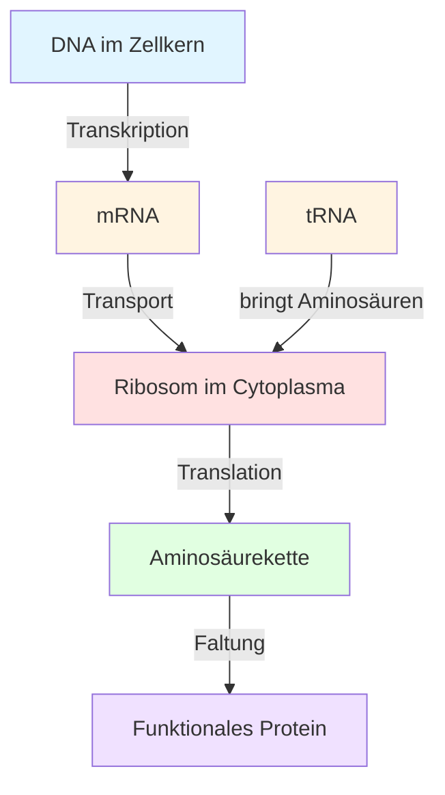

```mermaid
graph TB
    A[DNA im Zellkern] -->|Transkription| B[mRNA]
    B -->|Transport| C[Ribosom im Cytoplasma]
    C -->|Translation| D[Aminosäurekette]
    D -->|Faltung| E[Funktionales Protein]
    
    F[tRNA] -->|bringt Aminosäuren| C
    
    style A fill:#e1f5ff
    style B fill:#fff4e1
    style C fill:#ffe1e1
    style D fill:#e1ffe1
    style E fill:#f0e1ff
    style F fill:#fff4e1
```
