## Die wissenschaftliche Methode

Der Erkenntnisgewinn in der Chemie folgt einem systematischen, zyklischen Prozess:

```mermaid
flowchart TD
    A[🔍 Beobachtung] --> B[💡 Hypothese aufstellen]
    B --> C[🧪 Experiment durchführen]
    C --> D{Ergebnis bestätigt<br/>Hypothese?}
    D -->|Nein| B
    D -->|Ja| E[📐 Theorie formulieren]
    E --> F[🔬 Weitere Experimente]
    F --> G{Viele Bestätigungen<br/>ohne Ausnahmen?}
    G -->|Nein| E
    G -->|Ja| H[📜 Naturgesetz]
```

### Die Schritte im Detail

1. **Beobachtung:** Phänomene in der Natur werden systematisch wahrgenommen und dokumentiert.

2. **Hypothese:** Eine vorläufige Erklärung wird formuliert, die durch Experimente überprüft werden kann.

3. **Experiment:** Die Hypothese wird unter kontrollierten Bedingungen getestet.

4. **Theorie:** Wenn viele Experimente die Hypothese bestätigen, entsteht eine wissenschaftliche Theorie.

5. **Naturgesetz:** Eine Theorie, die sich ohne Ausnahmen bewährt hat, wird als Naturgesetz anerkannt.

> **Wichtig:** Ein **Naturgesetz** ist eine generelle Feststellung, die auf dem beobachteten Verhalten von Materie basiert und bei der keine Ausnahmen bekannt sind.
