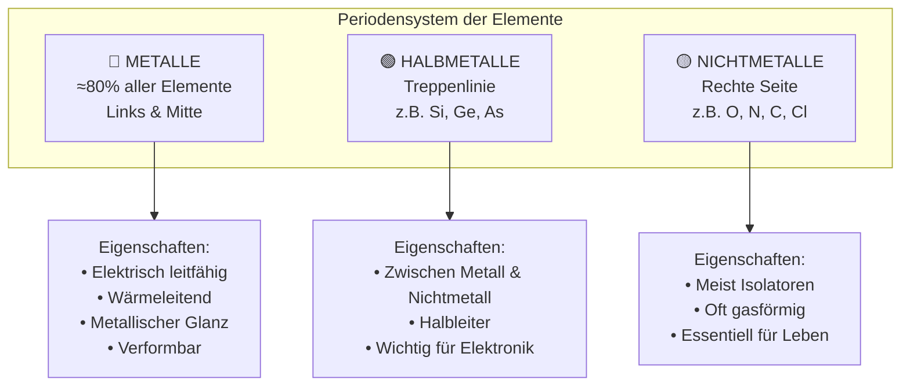

```mermaid
graph TB
    subgraph PSE["Periodensystem der Elemente"]
        direction TB
        
        M["🔵 METALLE<br/>≈80% aller Elemente<br/>Links & Mitte"]
        HM["🟢 HALBMETALLE<br/>Treppenlinie<br/>z.B. Si, Ge, As"]
        NM["🟡 NICHTMETALLE<br/>Rechte Seite<br/>z.B. O, N, C, Cl"]
    end
    
    M --> ME["Eigenschaften:<br/>• Elektrisch leitfähig<br/>• Wärmeleitend<br/>• Metallischer Glanz<br/>• Verformbar"]
    
    HM --> HME["Eigenschaften:<br/>• Zwischen Metall & Nichtmetall<br/>• Halbleiter<br/>• Wichtig für Elektronik"]
    
    NM --> NME["Eigenschaften:<br/>• Meist Isolatoren<br/>• Oft gasförmig<br/>• Essentiell für Leben"]
```

Die Elemente sind im Periodensystem nach steigender Ordnungszahl angeordnet. Die Treppenlinie (Halbmetalle) trennt Metalle von Nichtmetallen.
