## Der Aufbau des Atoms

Ein **Atom** ist der kleinste Baustein eines Elements, der noch die chemischen Eigenschaften dieses Elements besitzt.

### Die Bestandteile des Atoms

```mermaid
flowchart TD
    subgraph Atom
        subgraph Kern["⚛️ Atomkern"]
            P["🔴 Protonen<br/>(positiv geladen)"]
            N["⚪ Neutronen<br/>(neutral)"]
        end
        subgraph Huelle["☁️ Elektronenhülle"]
            E["🔵 Elektronen<br/>(negativ geladen)"]
        end
    end
```

### Eigenschaften der Teilchen

| Teilchen     | Ladung | Masse (u) | Ort   |
| ------------ | ------ | --------- | ----- |
| **Proton**   | +1     | 1,0073    | Kern  |
| **Neutron**  | 0      | 1,0087    | Kern  |
| **Elektron** | −1     | 0,00055   | Hülle |

### Wichtige Konzepte

- **Ordnungszahl (Z):** Anzahl der Protonen im Kern = Anzahl der Elektronen in einem neutralen Atom
- **Massenzahl (A):** Summe aus Protonen und Neutronen
- **Elektronenwolke:** Elektronen befinden sich nicht auf festen Bahnen, sondern in einem Wahrscheinlichkeitsbereich um den Kern

> **Merke:** Der Atomkern macht nur etwa 0,01% des Atomvolumens aus, enthält aber 99,9% der Masse!
