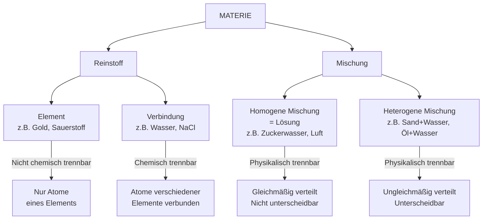

Dieses Diagramm zeigt, wie Materie hierarchisch klassifiziert wird. Der wichtigste Unterschied: **Chemische Trennverfahren** (z.B. Elektrolyse) trennen Verbindungen in Elemente, **physikalische Trennverfahren** (z.B. Destillation, Filtration) trennen Mischungen.
