## Klassifizierung von Stoffen

Das folgende Diagramm zeigt, wie Stoffe systematisch eingeteilt werden können:

```mermaid
flowchart TD
    A[🧪 Stoff] --> B{Besteht aus einem<br/>Reinstoff?}
    B -->|Ja| C[Reinstoff]
    B -->|Nein| D[Mischung/Gemisch]
    
    C --> E{Kann chemisch<br/>zerlegt werden?}
    E -->|Nein| F[⚛️ Element<br/>z.B. Gold, Sauerstoff]
    E -->|Ja| G[🔬 Verbindung<br/>z.B. Wasser, NaCl]
    
    D --> H{Bestandteile<br/>erkennbar?}
    H -->|Nein| I[Homogene Mischung<br/>z.B. Salzwasser, Luft]
    H -->|Ja| J[Heterogene Mischung<br/>z.B. Müsli, Sand+Wasser]
```

**Entscheidungsfragen zur Klassifizierung:**

1. Ist es ein einzelner Stoff oder eine Mischung?
2. Bei Reinstoffen: Kann er chemisch zerlegt werden?
3. Bei Mischungen: Sind die Bestandteile sichtbar unterschiedlich?
