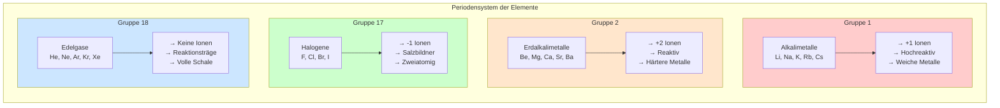

## Übersicht der wichtigen Hauptgruppen

### Merkhilfe für typische Ionenladungen

| Hauptgruppe | Valenzelektronen | Typische Ladung | Beispiel  |
| ----------- | ---------------- | --------------- | --------- |
| 1           | 1                | +1              | $Na^+$    |
| 2           | 2                | +2              | $Ca^{2+}$ |
| 16          | 6                | -2              | $O^{2-}$  |
| 17          | 7                | -1              | $Cl^-$    |
| 18          | 8                | 0 (keine Ionen) | Ar        |
