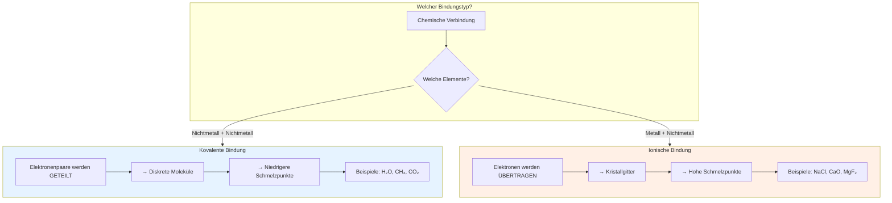

## Vergleich: Kovalente vs. Ionische Bindung

### Kurzübersicht

| Kriterium              | Kovalent       | Ionisch                      |
| ---------------------- | -------------- | ---------------------------- |
| Elektronenverhalten    | Teilen         | Übertragen                   |
| Beteiligte Elemente    | Nichtmetalle   | Metall + Nichtmetall         |
| Struktur               | Moleküle       | Ionengitter                  |
| Leitfähigkeit          | Nicht leitend  | Leitend (geschmolzen/gelöst) |
| Typische Eigenschaften | Niedriger Smp. | Hoher Smp., spröde           |
