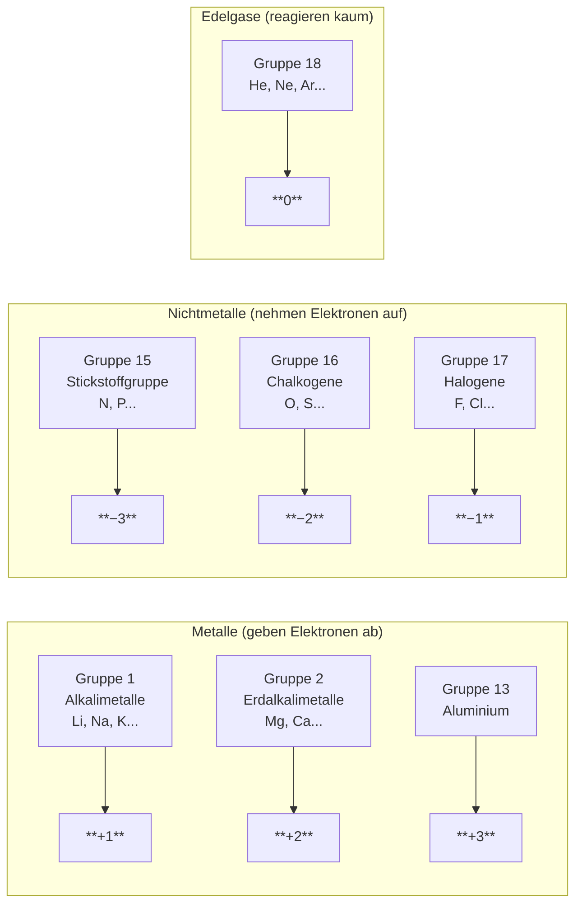

# Übersicht der wichtigen Hauptgruppen

Das folgende Diagramm zeigt die Beziehung zwischen Hauptgruppen und typischen Ionenladungen:

## Merkhilfe für Ladungen

| Gruppe | Valenzelektronen | Ionenladung | Beispiel    |
| ------ | ---------------- | ----------- | ----------- |
| 1      | 1                | +1          | Na → Na⁺    |
| 2      | 2                | +2          | Ca → Ca²⁺   |
| 16     | 6                | −2          | O → O²⁻     |
| 17     | 7                | −1          | Cl → Cl⁻    |
| 18     | 8                | 0           | Ar (stabil) |
