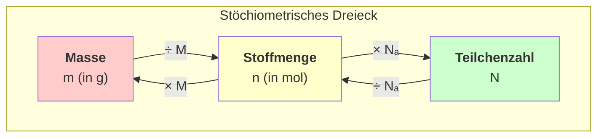

## Das Mol-Umrechnungsdreieck

### Schnellübersicht der Formeln

| Von → Nach     | Formel              | Beispiel                         |
| -------------- | ------------------- | -------------------------------- |
| Gramm → Mol    | $n = \frac{m}{M}$   | 18g H₂O ÷ 18 g/mol = 1 mol       |
| Mol → Gramm    | $m = n \times M$    | 2 mol H₂O × 18 g/mol = 36g       |
| Mol → Teilchen | $N = n \times N_A$  | 1 mol × 6,022×10²³ = 6,022×10²³  |
| Teilchen → Mol | $n = \frac{N}{N_A}$ | 3,01×10²³ ÷ 6,022×10²³ = 0,5 mol |

### Wichtige Konstanten

- **Avogadro-Konstante:** $N_A = 6,022 \times 10^{23}$ mol$^{-1}$
- **Molare Masse:** Entspricht zahlenmäßig dem Atomgewicht/Molekülgewicht

> **Tipp:** Das Mol steht immer im Zentrum! Rechne immer erst in Mol um, dann weiter zur Zielgröße.
