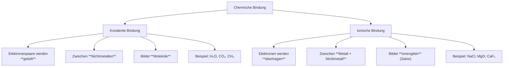

# Kovalente vs. Ionische Bindung

Das folgende Diagramm zeigt die beiden Haupttypen chemischer Bindungen:

## Vergleich der Bindungstypen

| Eigenschaft                        | Kovalente Bindung         | Ionische Bindung     |
| ---------------------------------- | ------------------------- | -------------------- |
| Elektronen                         | Geteilt                   | Übertragen           |
| Partner                            | Nichtmetall + Nichtmetall | Metall + Nichtmetall |
| Struktureinheit                    | Moleküle                  | Ionen im Gitter      |
| Schmelzpunkt                       | Oft niedrig               | Meist hoch           |
| Leitfähigkeit (fest)               | Keine                     | Keine                |
| Leitfähigkeit (geschmolzen/gelöst) | Keine                     | Ja (Ionen beweglich) |

## Merksatz

> 🔗 **Nichtmetalle teilen** (kovalent) → Moleküle
>
> ⚡ **Metall + Nichtmetall übertragen** (ionisch) → Salze
