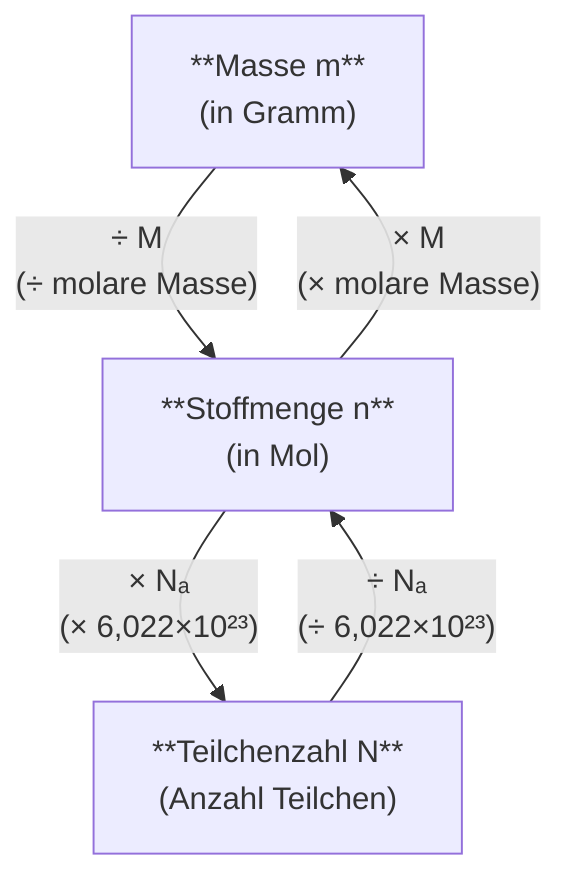

# Das Mol-Umrechnungsdreieck

Das folgende Diagramm zeigt die Beziehungen zwischen Masse, Stoffmenge und Teilchenzahl:

## Zusammenfassung der Formeln

| Von                   | Nach  | Rechnung         |
| --------------------- | ----- | ---------------- |
| Masse → Stoffmenge    | m → n | n = m ÷ M        |
| Stoffmenge → Masse    | n → m | m = n × M        |
| Stoffmenge → Teilchen | n → N | N = n × Nₐ       |
| Teilchen → Stoffmenge | N → n | n = N ÷ Nₐ       |
| Masse → Teilchen      | m → N | N = (m ÷ M) × Nₐ |

## Merkhilfe

> 🔺 Das Mol steht in der Mitte!
>
> - Nach **oben** (Masse): **mal M**
> - Nach **unten** (Teilchen): **mal Nₐ**
> - Von Masse/Teilchen zum Mol: **teilen**
