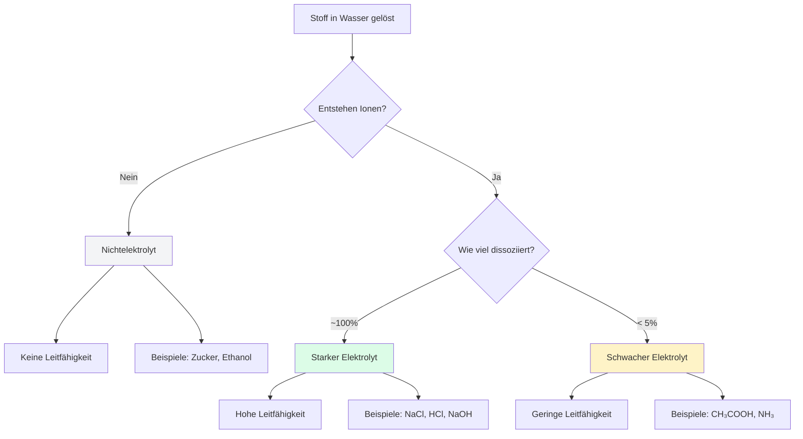

## Zusammenfassung

| Typ         | Dissoziation | Leitfähigkeit | Pfeil                | Beispiele                  |
| ----------- | ------------ | ------------- | -------------------- | -------------------------- |
| **Stark**   | ~100%        | Hoch          | $\rightarrow$        | Salze, starke Säuren/Basen |
| **Schwach** | < 5%         | Gering        | $\rightleftharpoons$ | Essigsäure, Ammoniak       |
| **Nicht**   | 0%           | Keine         | —                    | Zucker, Alkohole           |
