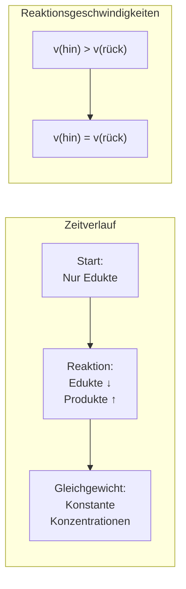

# Entwicklung zum Gleichgewicht

Das folgende Diagramm zeigt, wie sich die Konzentrationen von Edukten und Produkten mit der Zeit entwickeln, bis das Gleichgewicht erreicht ist.

## Was passiert zeitlich?

| Phase             | Edukte   | Produkte | Hinreaktion    | Rückreaktion  |
| ----------------- | -------- | -------- | -------------- | ------------- |
| **Start**         | Hoch     | Null     | Schnell        | Keine         |
| **Reaktion**      | Sinkt    | Steigt   | Langsamer      | Schneller     |
| **Gleichgewicht** | Konstant | Konstant | = Rückreaktion | = Hinreaktion |

## Wichtige Erkenntnis

Im Gleichgewicht sind Edukt- und Produktkonzentrationen **nicht unbedingt gleich**! Sie sind nur **konstant**. Das Verhältnis hängt von der Gleichgewichtskonstante ab.
