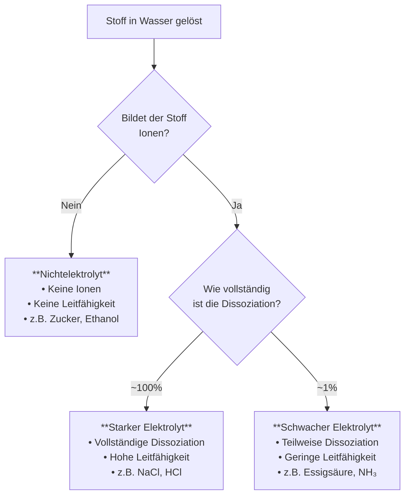

# Vergleich der Elektrolyttypen

Das folgende Diagramm zeigt die drei Elektrolyttypen im Überblick.

## Praktische Bedeutung

| Elektrolyttyp | Pfeilsymbol | Im Körper                    |
| ------------- | ----------- | ---------------------------- |
| Stark         | →           | Mineralstoffe (Na⁺, K⁺, Cl⁻) |
| Schwach       | ⇌           | Kohlensäure im Blut          |
| Nicht         | → (Molekül) | Glucose, Harnstoff           |

> 💡 **Ernährungsbezug:** Elektrolyte im Sport-Drink sind starke Elektrolyte – sie dissoziieren vollständig und liefern sofort verfügbare Ionen!
