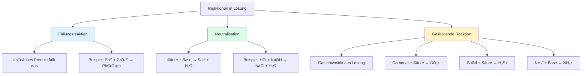

## Treibende Kräfte

Alle diese Reaktionen haben gemeinsam, dass ein **Produkt aus der Lösung entfernt** wird:

| Reaktionstyp       | Treibende Kraft                      |
| ------------------ | ------------------------------------ |
| **Fällung**        | Bildung eines unlöslichen Feststoffs |
| **Neutralisation** | Bildung von stabilem Wasser          |
| **Gasbildung**     | Entweichen eines Gases               |

Durch das Entfernen des Produkts wird das Gleichgewicht nach rechts verschoben – die Reaktion läuft vollständig ab.
