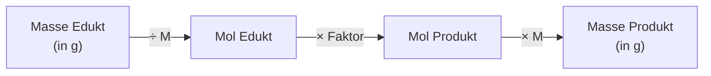

## Der 4-Schritte-Plan

Um quantitative Fragen zu beantworten wie "Wie viel Produkt entsteht aus X Gramm Edukt?", verwenden wir einen systematischen Ansatz:

### Masse → Mol → Mol → Masse

### Die vier Schritte im Detail

1. **Masse → Mol** (Edukt)
   $$n = \frac{m}{M}$$

2. **Mol Edukt → Mol Produkt** (stöchiometrischer Faktor)
   $$n_{Produkt} = n_{Edukt} \times \frac{\text{Koeffizient Produkt}}{\text{Koeffizient Edukt}}$$

3. **Mol → Masse** (Produkt)
   $$m = n \times M$$

### Wichtig zu beachten

- Immer zuerst die Reaktionsgleichung **ausgleichen**!
- Der stöchiometrische Faktor kommt aus den **Koeffizienten**
- Einheiten kontrollieren: g/mol, mol, g
