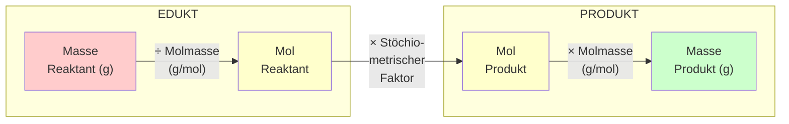

# Der 4-Schritte-Plan im Überblick

Das folgende Diagramm zeigt den systematischen Weg für stöchiometrische Berechnungen.

## Zusammenfassung der Umrechnungen

| Schritt | Umrechnung                 | Formel                                     |
| ------- | -------------------------- | ------------------------------------------ |
| **1**   | Masse → Mol (Reaktant)     | $n = \frac{m}{M}$                          |
| **2**   | Mol Reaktant → Mol Produkt | $n_P = n_R \times \frac{Koeff_P}{Koeff_R}$ |
| **3**   | Mol → Masse (Produkt)      | $m = n \times M$                           |

## Merkhilfe

> 🎯 **Gramm rein, Mol hin, Faktor drauf, Gramm raus!**
