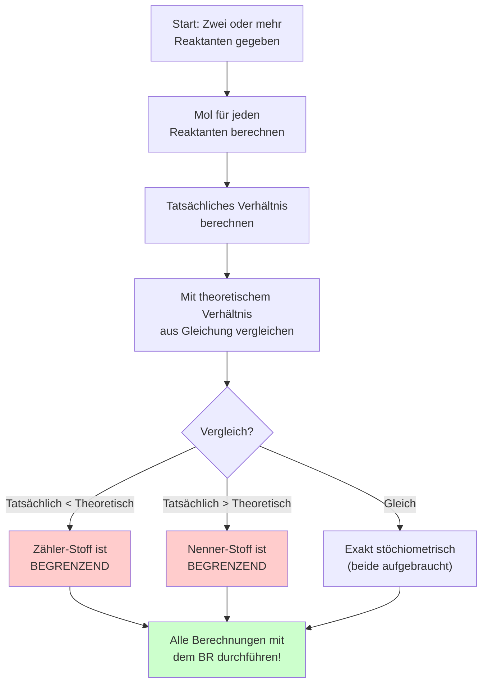

# Begrenzender Reaktant im Überblick

Das folgende Diagramm zeigt den Entscheidungsprozess zur Identifikation des begrenzenden Reaktanten.

## Merkhilfe

> 🎯 **Der begrenzende Reaktant bestimmt, wie viel Produkt entstehen kann!**
>
> Stellen Sie sich vor: Sie können nur so viele Sandwiches machen, wie Sie Käse haben – egal wie viel Brot noch da ist.
