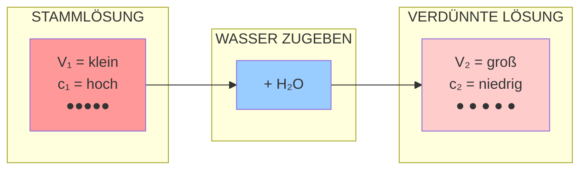

# Verdünnung visualisiert

Das folgende Diagramm zeigt, was bei einer Verdünnung passiert.

## Was bleibt konstant?

| Größe            | Verändert sich?      |
| ---------------- | -------------------- |
| Volumen V        | ↑ Wird größer        |
| Konzentration c  | ↓ Wird kleiner       |
| **Stoffmenge n** | **= Bleibt gleich!** |

## Die goldene Regel

$$\boxed{c_1 \times V_1 = c_2 \times V_2}$$

> Die Anzahl der gelösten Teilchen ändert sich nicht – sie werden nur auf ein größeres Volumen verteilt!
