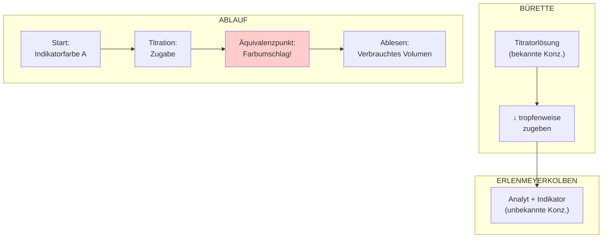

# Aufbau einer Titration

Das folgende Diagramm zeigt den typischen Aufbau einer Säure-Base-Titration.

## Ablauf in Kurzform

| Schritt | Aktion                                         |
| ------- | ---------------------------------------------- |
| **1**   | Analyt + Indikator in Kolben                   |
| **2**   | Bürette mit Titrator füllen, Nullpunkt ablesen |
| **3**   | Langsam zutropfen lassen                       |
| **4**   | Bei Farbumschlag stoppen                       |
| **5**   | Volumen ablesen                                |
| **6**   | Berechnung durchführen                         |

## Wichtig

> ⚠️ **Präzision ist entscheidend!**
> - Tropfenweise zugeben nahe dem Äquivalenzpunkt
> - Volumen auf 0,05 mL genau ablesen
> - Kolben regelmäßig schwenken
