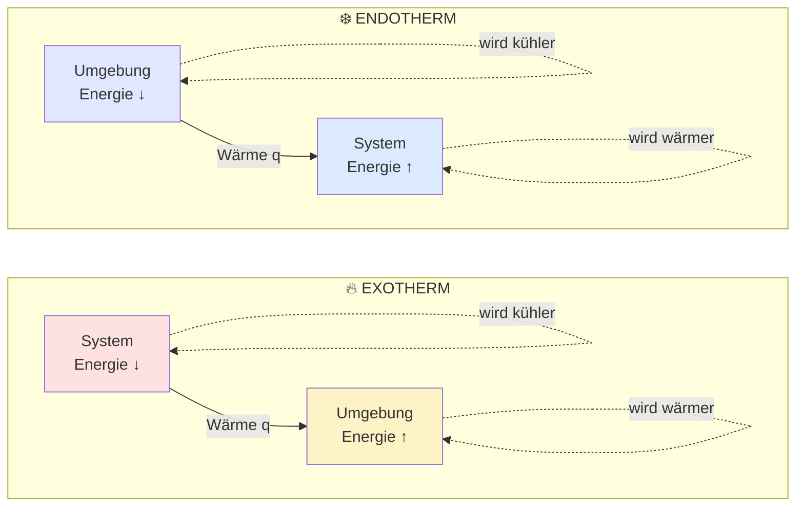

## Zusammenfassung der Energieflüsse

| Aspekt                  | Exotherm           | Endotherm          |
| ----------------------- | ------------------ | ------------------ |
| **Energierichtung**     | System → Umgebung  | Umgebung → System  |
| **Systemenergie**       | nimmt ab           | nimmt zu           |
| **Umgebungstemperatur** | steigt             | sinkt              |
| **Gefäß anfassen**      | fühlt sich warm an | fühlt sich kalt an |
| **Vorzeichen q**        | negativ (−)        | positiv (+)        |
| **Beispiel**            | Verbrennung        | Verdunstung        |
