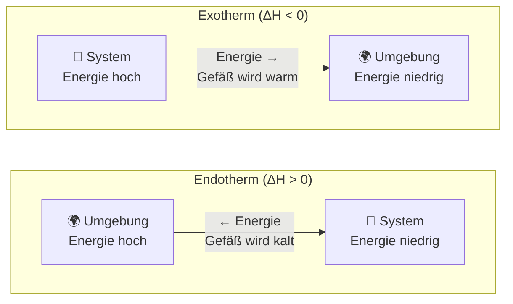

# Energiefluss: System und Umgebung

Das folgende Diagramm visualisiert den Unterschied zwischen exothermen und endothermen Prozessen.

## Zusammenfassung der Vorzeichen

| Prozesstyp    | Energierichtung   | $\Delta H$ | Gefäß fühlt sich... |
| ------------- | ----------------- | ---------- | ------------------- |
| **Exotherm**  | System → Umgebung | negativ    | warm an             |
| **Endotherm** | Umgebung → System | positiv    | kalt an             |

> **Eselsbrücke:** "**Ex**o" wie "**Ex**it" - die Energie verlässt das System!
