# Energiefluss: System und Umgebung

Das folgende Diagramm visualisiert den Unterschied zwischen exothermen und endothermen Prozessen.

```mermaid
flowchart TB
    subgraph EXO["Exotherm (ΔH < 0)"]
        direction LR
        S1["🧪 System<br/>Energie hoch"]
        U1["🌍 Umgebung<br/>Energie niedrig"]
        S1 -->|"Energie →<br/>Gefäß wird warm"| U1
    end
    
    subgraph ENDO["Endotherm (ΔH > 0)"]
        direction LR
        U2["🌍 Umgebung<br/>Energie hoch"]
        S2["🧪 System<br/>Energie niedrig"]
        U2 -->|"← Energie<br/>Gefäß wird kalt"| S2
    end
    
    EXO ~~~ ENDO
```

## Zusammenfassung der Vorzeichen

| Prozesstyp    | Energierichtung   | $\Delta H$ | Gefäß fühlt sich... |
| ------------- | ----------------- | ---------- | ------------------- |
| **Exotherm**  | System → Umgebung | negativ    | warm an             |
| **Endotherm** | Umgebung → System | positiv    | kalt an             |

> **Eselsbrücke:** "**Ex**o" wie "**Ex**it" - die Energie verlässt das System!
