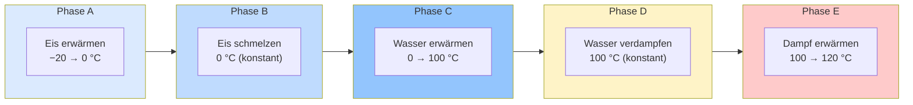

## Die fünf Phasen der Heizkurve

| Phase | Prozess           | Formel                              | Temperatur          |
| ----- | ----------------- | ----------------------------------- | ------------------- |
| **A** | Eis erwärmen      | $q = mc_{\text{Eis}}\Delta T$       | steigt              |
| **B** | Eis schmelzen     | $q = m \cdot \Delta H_{\text{fus}}$ | **konstant 0 °C**   |
| **C** | Wasser erwärmen   | $q = mc_{\text{Wasser}}\Delta T$    | steigt              |
| **D** | Wasser verdampfen | $q = m \cdot \Delta H_{\text{vap}}$ | **konstant 100 °C** |
| **E** | Dampf erwärmen    | $q = mc_{\text{Dampf}}\Delta T$     | steigt              |

## Wichtige Beobachtungen

1. **Plateaus** bei 0 °C und 100 °C: Hier findet Phasenumwandlung statt
2. **Steigung** der Kurve hängt von der spezifischen Wärmekapazität ab
3. Das **Verdampfungsplateau** ist am längsten (meiste Energie nötig)
