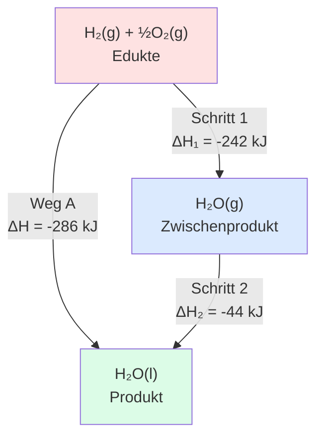

## Die Wegunabhängigkeit

Beide Wege führen zum gleichen Ergebnis:

| Weg                | Berechnung                               | Ergebnis |
| ------------------ | ---------------------------------------- | -------- |
| **A** (direkt)     | $\Delta H_A$                             | −286 kJ  |
| **B** (über Dampf) | $\Delta H_1 + \Delta H_2 = -242 + (-44)$ | −286 kJ  |

## Anwendung: Reaktionen kombinieren

Mit dem Satz von Hess können wir:

1. **Gleichungen addieren** → $\Delta H$-Werte addieren
2. **Gleichungen umkehren** → $\Delta H$ Vorzeichen wechseln
3. **Gleichungen multiplizieren** → $\Delta H$ mit gleichem Faktor multiplizieren
