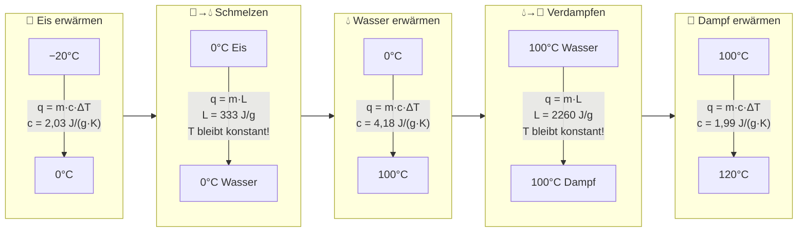

# Heizkurve von Wasser

Die Heizkurve zeigt den Zusammenhang zwischen zugeführter Energie und Temperatur. Beachte die horizontalen Plateaus bei den Phasenübergängen!

## Typische Heizkurve grafisch

| Abschnitt       | Temperaturverlauf        | Formel                                         |
| --------------- | ------------------------ | ---------------------------------------------- |
| Eis erwärmen    | Ansteigend (steil)       | $q = m \cdot c_{\text{Eis}} \cdot \Delta T$    |
| **Schmelzen**   | **Horizontal bei 0°C**   | $q = m \cdot 333 \frac{\text{J}}{\text{g}}$    |
| Wasser erwärmen | Ansteigend (flacher)     | $q = m \cdot c_{\text{Wasser}} \cdot \Delta T$ |
| **Verdampfen**  | **Horizontal bei 100°C** | $q = m \cdot 2260 \frac{\text{J}}{\text{g}}$   |
| Dampf erwärmen  | Ansteigend (steil)       | $q = m \cdot c_{\text{Dampf}} \cdot \Delta T$  |

> **Merke:** Die horizontalen Abschnitte sind typisch für Phasenübergänge - alle Energie fließt in die Umwandlung, nicht in Temperaturerhöhung!
