# Heizkurve von Wasser

Die Heizkurve zeigt den Zusammenhang zwischen zugeführter Energie und Temperatur. Beachte die horizontalen Plateaus bei den Phasenübergängen!

```mermaid
flowchart LR
    subgraph A["🧊 Eis erwärmen"]
        A1["−20°C"] -->|"q = m·c·ΔT<br/>c = 2,03 J/(g·K)"| A2["0°C"]
    end
    
    subgraph B["🧊→💧 Schmelzen"]
        B1["0°C Eis"] -->|"q = m·L<br/>L = 333 J/g<br/>T bleibt konstant!"| B2["0°C Wasser"]
    end
    
    subgraph C["💧 Wasser erwärmen"]
        C1["0°C"] -->|"q = m·c·ΔT<br/>c = 4,18 J/(g·K)"| C2["100°C"]
    end
    
    subgraph D["💧→💨 Verdampfen"]
        D1["100°C Wasser"] -->|"q = m·L<br/>L = 2260 J/g<br/>T bleibt konstant!"| D2["100°C Dampf"]
    end
    
    subgraph E["💨 Dampf erwärmen"]
        E1["100°C"] -->|"q = m·c·ΔT<br/>c = 1,99 J/(g·K)"| E2["120°C"]
    end
    
    A --> B --> C --> D --> E
```

## Typische Heizkurve grafisch

| Abschnitt       | Temperaturverlauf        | Formel                                         |
| --------------- | ------------------------ | ---------------------------------------------- |
| Eis erwärmen    | Ansteigend (steil)       | $q = m \cdot c_{\text{Eis}} \cdot \Delta T$    |
| **Schmelzen**   | **Horizontal bei 0°C**   | $q = m \cdot 333 \frac{\text{J}}{\text{g}}$    |
| Wasser erwärmen | Ansteigend (flacher)     | $q = m \cdot c_{\text{Wasser}} \cdot \Delta T$ |
| **Verdampfen**  | **Horizontal bei 100°C** | $q = m \cdot 2260 \frac{\text{J}}{\text{g}}$   |
| Dampf erwärmen  | Ansteigend (steil)       | $q = m \cdot c_{\text{Dampf}} \cdot \Delta T$  |

> **Merke:** Die horizontalen Abschnitte sind typisch für Phasenübergänge - alle Energie fließt in die Umwandlung, nicht in Temperaturerhöhung!
