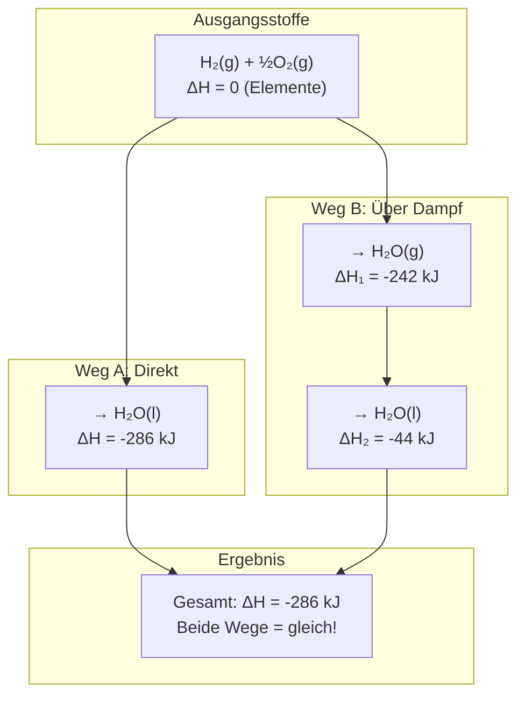

# Der Satz von Hess visualisiert

Dieses Diagramm zeigt, wie verschiedene Reaktionswege zur gleichen Gesamtenthalpie führen.

## Das Prinzip

| Weg   | Schritte                                         | Gesamt-ΔH              |
| ----- | ------------------------------------------------ | ---------------------- |
| **A** | Direkt zu flüssigem Wasser                       | -286 kJ                |
| **B** | Erst Dampf (-242 kJ), dann Kondensation (-44 kJ) | -242 + (-44) = -286 kJ |

> **Kernaussage des Satzes von Hess:**
> Der Weg spielt keine Rolle - nur Anfangs- und Endzustand bestimmen $\Delta H$.

## Warum ist das nützlich?

Manche Reaktionen lassen sich nicht direkt im Labor durchführen. Mit dem Satz von Hess können wir ihre Enthalpie trotzdem berechnen, indem wir einen alternativen Weg über bekannte Reaktionen nehmen.
