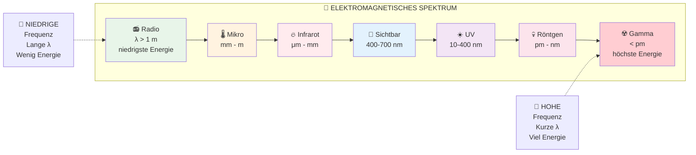

## Zusammenfassung der Beziehungen

- **Kurze Wellenlänge** → **Hohe Frequenz** → **Hohe Energie**
- **Lange Wellenlänge** → **Niedrige Frequenz** → **Niedrige Energie**

Die Energie nimmt von links (Radio) nach rechts (Gamma) zu!
