```mermaid
flowchart LR
    subgraph SPEKTRUM["📡 ELEKTROMAGNETISCHES SPEKTRUM"]
        direction LR
        R["📻 Radio<br/>λ > 1 m<br/>niedrigste Energie"]
        M["🌡️ Mikro<br/>mm - m"]
        I["🔥 Infrarot<br/>μm - mm"]
        V["🌈 Sichtbar<br/>400-700 nm"]
        U["☀️ UV<br/>10-400 nm"]
        X["💀 Röntgen<br/>pm - nm"]
        G["☢️ Gamma<br/>< pm<br/>höchste Energie"]
        
        R --> M --> I --> V --> U --> X --> G
    end
    
    LOW["🔽 NIEDRIGE<br/>Frequenz<br/>Lange λ<br/>Wenig Energie"] -.-> R
    HIGH["🔼 HOHE<br/>Frequenz<br/>Kurze λ<br/>Viel Energie"] -.-> G
    
    style R fill:#e8f5e9
    style M fill:#fff3e0
    style I fill:#ffebee
    style V fill:#e3f2fd
    style U fill:#f3e5f5
    style X fill:#fce4ec
    style G fill:#ffcdd2
```

## Zusammenfassung der Beziehungen

- **Kurze Wellenlänge** → **Hohe Frequenz** → **Hohe Energie**
- **Lange Wellenlänge** → **Niedrige Frequenz** → **Niedrige Energie**

Die Energie nimmt von links (Radio) nach rechts (Gamma) zu!
