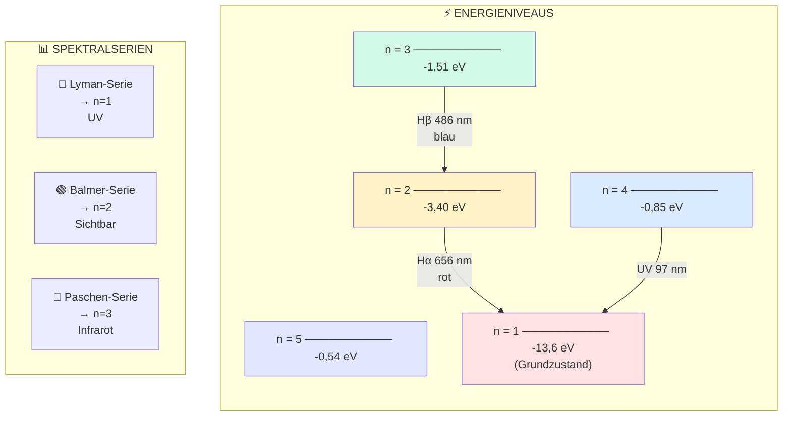

## Wichtige Erkenntnisse

- Je größer der Sprung (Δn), desto mehr Energie wird freigesetzt
- Übergänge zu n=1 (Lyman) → UV-Strahlung
- Übergänge zu n=2 (Balmer) → Sichtbares Licht
- Übergänge zu n=3 (Paschen) → Infrarot
