```mermaid
flowchart TB
    subgraph NIVEAUS["⚡ ENERGIENIVEAUS"]
        direction TB
        N5["n = 5 ─────────── -0,54 eV"]
        N4["n = 4 ─────────── -0,85 eV"]
        N3["n = 3 ─────────── -1,51 eV"]
        N2["n = 2 ─────────── -3,40 eV"]
        N1["n = 1 ─────────── -13,6 eV<br/>(Grundzustand)"]
    end
    
    subgraph SERIEN["📊 SPEKTRALSERIEN"]
        L["🔵 Lyman-Serie<br/>→ n=1<br/>UV"]
        B["🟢 Balmer-Serie<br/>→ n=2<br/>Sichtbar"]
        P["🔴 Paschen-Serie<br/>→ n=3<br/>Infrarot"]
    end
    
    N2 -->|"Hα 656 nm<br/>rot"| N1
    N3 -->|"Hβ 486 nm<br/>blau"| N2
    N4 -->|"UV 97 nm"| N1
    
    style N1 fill:#fee2e2
    style N2 fill:#fef3c7
    style N3 fill:#d1fae5
    style N4 fill:#dbeafe
    style N5 fill:#e0e7ff
```

## Wichtige Erkenntnisse

- Je größer der Sprung (Δn), desto mehr Energie wird freigesetzt
- Übergänge zu n=1 (Lyman) → UV-Strahlung
- Übergänge zu n=2 (Balmer) → Sichtbares Licht
- Übergänge zu n=3 (Paschen) → Infrarot
