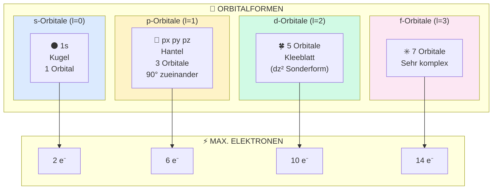

```mermaid
flowchart TB
    subgraph ORBITALE["🔮 ORBITALFORMEN"]
        direction TB
        
        subgraph S["s-Orbitale (l=0)"]
            S1["⚫ 1s<br/>Kugel<br/>1 Orbital"]
        end
        
        subgraph P["p-Orbitale (l=1)"]
            P1["🎱 px py pz<br/>Hantel<br/>3 Orbitale<br/>90° zueinander"]
        end
        
        subgraph D["d-Orbitale (l=2)"]
            D1["🍀 5 Orbitale<br/>Kleeblatt<br/>(dz² Sonderform)"]
        end
        
        subgraph F["f-Orbitale (l=3)"]
            F1["✳️ 7 Orbitale<br/>Sehr komplex"]
        end
    end
    
    subgraph ELEKTRONEN["⚡ MAX. ELEKTRONEN"]
        E1["2 e⁻"]
        E2["6 e⁻"]
        E3["10 e⁻"]
        E4["14 e⁻"]
    end
    
    S1 --> E1
    P1 --> E2
    D1 --> E3
    F1 --> E4
    
    style S fill:#dbeafe
    style P fill:#fef3c7
    style D fill:#d1fae5
    style F fill:#fce7f3
```

## Merkregel

- **s**harp → 1 Kugel → 2 Elektronen
- **p**rincipal → 3 Hanteln → 6 Elektronen
- **d**iffuse → 5 Kleeblätter → 10 Elektronen
- **f**undamental → 7 komplexe → 14 Elektronen
