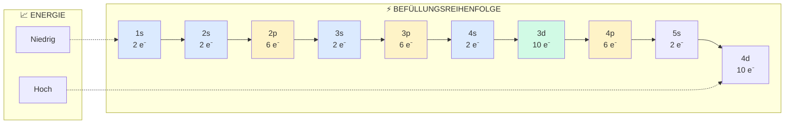

```mermaid
flowchart LR
    subgraph REIHENFOLGE["⚡ BEFÜLLUNGSREIHENFOLGE"]
        direction LR
        O1["1s<br/>2 e⁻"] --> O2["2s<br/>2 e⁻"]
        O2 --> O3["2p<br/>6 e⁻"]
        O3 --> O4["3s<br/>2 e⁻"]
        O4 --> O5["3p<br/>6 e⁻"]
        O5 --> O6["4s<br/>2 e⁻"]
        O6 --> O7["3d<br/>10 e⁻"]
        O7 --> O8["4p<br/>6 e⁻"]
        O8 --> O9["5s<br/>2 e⁻"]
        O9 --> O10["4d<br/>10 e⁻"]
    end
    
    subgraph ENERGIE["📈 ENERGIE"]
        LOW["Niedrig"] -.-> O1
        HIGH["Hoch"] -.-> O10
    end
    
    style O1 fill:#dbeafe
    style O2 fill:#dbeafe
    style O3 fill:#fef3c7
    style O4 fill:#dbeafe
    style O5 fill:#fef3c7
    style O6 fill:#dbeafe
    style O7 fill:#d1fae5
    style O8 fill:#fef3c7
```

## Merke

Die Energie steigt von links nach rechts. Beachte: 4s wird VOR 3d gefüllt!
