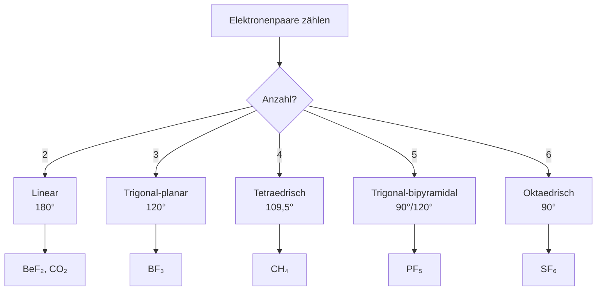

## VSEPR-Geometrien im Überblick

```mermaid
flowchart TD
    A[Elektronenpaare zählen] --> B{Anzahl?}
    B -->|2| C[Linear<br/>180°]
    B -->|3| D[Trigonal-planar<br/>120°]
    B -->|4| E[Tetraedrisch<br/>109,5°]
    B -->|5| F[Trigonal-bipyramidal<br/>90°/120°]
    B -->|6| G[Oktaedrisch<br/>90°]

    C --> H[BeF₂, CO₂]
    D --> I[BF₃]
    E --> J[CH₄]
    F --> K[PF₅]
    G --> L[SF₆]
```
