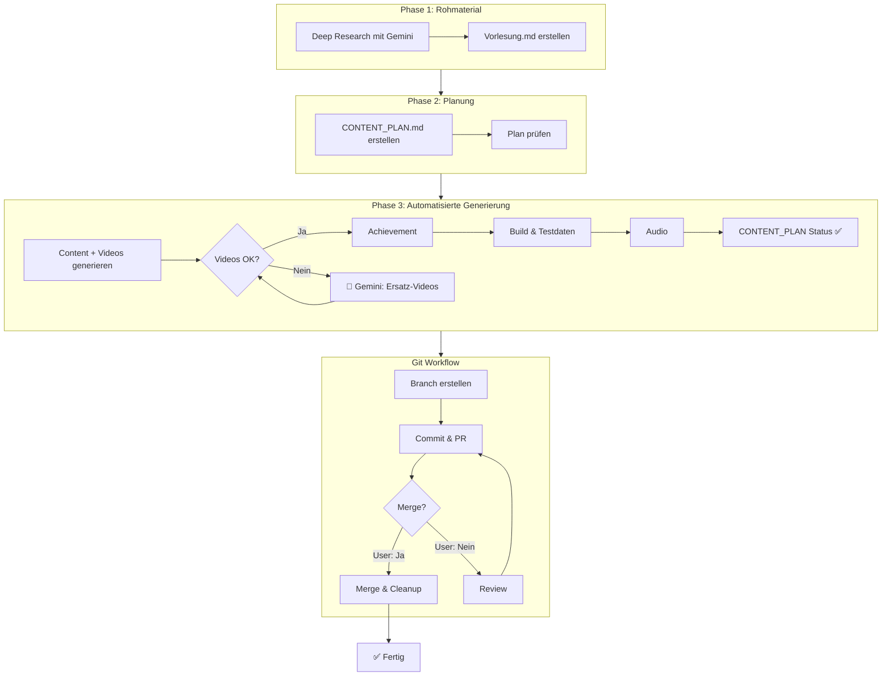

# AI-gestützte Content-Erstellung: Studentengerechtes Setup

## Übersicht

Dieses Setup nutzt zwei kostenlose AI-Tools zur Erstellung von Lerninhalten:

| Aufgabe                          | Tool                             | Kosten                   |
| -------------------------------- | -------------------------------- | ------------------------ |
| **Deep Research & Quellinhalte** | Google AI Studio (Gemini Pro)    | Kostenlos (Free Tier)    |
| **Video-Recherche (Prompt)**     | VS Code + Claude Sonnet/Opus     | Kostenlos (Student Pack) |
| **Video-Recherche (Suche)**      | Google AI Studio + Web-Grounding | Kostenlos (Free Tier)    |
| **Content-Erstellung für App**   | GitHub Copilot + Claude Opus 4   | Kostenlos (Student Pack) |
| **Video-Transkription**          | OpenAI Whisper (lokal)           | Kostenlos                |

> **Geschätzte Gesamtkosten: €0/Monat**

---

## Content-Struktur V4

Jeder Abschnitt einer Vorlesung folgt dem Muster **Lernen → Überprüfen → Anwenden**:

### Abschnitts-Struktur

| Phase            | Typ                  | Beschreibung                   |
| ---------------- | -------------------- | ------------------------------ |
| 📚 **Lernen**     | `learning-content`   | Theorie, Konzepte, Formeln     |
| ✅ **Überprüfen** | `self-assessment-mc` | Einfache MC-Fragen             |
|                  | `fill-in-the-blank`  | Lückentexte                    |
|                  | `matching`           | Zuordnungsaufgaben             |
|                  | `ordering`           | Sortieraufgaben                |
| 🧮 **Anwenden**   | `practice-exercise`  | Alltagsbezogene Anwendung      |
|                  | `calculation`        | Berechnungen                   |
| 📺 **Video**      | `youtube-video`      | An thematisch passender Stelle |

### Vorlesungs-Abschluss

| Typ                 | Beschreibung                                    |
| ------------------- | ----------------------------------------------- |
| 📋 `self-assessment` | Checkliste: Bin ich bereit für den Test?        |
| 📝 `questions/`      | 12 schwierige `multiple-choice-multiple` Fragen |
| 🎓 `module-exam/`    | 2 sehr schwierige Transferfragen pro Vorlesung  |

---

## Der Workflow (3 Phasen + Automatisierung)

Der gesamte Workflow ist weitgehend automatisiert. Es gibt nur **2 Stop-Points**, an denen manuelle Eingriffe nötig sind.

### Workflow-Übersicht



### Stop-Go Points

| Phase | Stop-Point          | Grund                  | Aktion                          |
| ----- | ------------------- | ---------------------- | ------------------------------- |
| **3** | Video-Verifizierung | Videos nicht verfügbar | Gemini-Prompt für Ersatz-Videos |
| **3** | Merge               | Qualitätsprüfung       | User muss explizit bestätigen   |

Alle anderen Schritte laufen **automatisch** durch!

### Phase 1: Rohmaterial zusammenstellen

**Tools:** Google AI Studio (Gemini Pro)

1. **Deep Research** mit Web-Grounding → `Vorlesung.md`

**Speicherort:** `studies-material/{studyId}/NN-modul/NN-vorlesung/`

> **Hinweis:** Video-Recherche ist NICHT mehr Teil von Phase 1. Der Copilot-Agent schlägt automatisch passende Videos vor (Schritt 3). Nur bei ungültigen Videos wird Gemini benötigt (Stop-Point in Schritt 5).

### Phase 2: CONTENT_PLAN.md erstellen

**Tool:** VS Code (Copilot) + manuelle Prüfung

- Definiert **EXAKT** welche Dateien erstellt werden
- Dateinamen, Typen, Reihenfolge festlegen
- Video-Platzhalter an passenden Stellen einplanen (URLs werden automatisch gefunden)
- Plan prüfen und bei Bedarf überarbeiten

**Speicherort:** `CONTENT_PLAN.md` im Material-Ordner

### Phase 3: Automatisierte Content-Generierung (11 Schritte)

**Tool:** GitHub Copilot (Agent Mode) + Claude Opus 4

Der Copilot-Agent führt diese Schritte automatisch aus:

| Schritt | Beschreibung                    | Automatisch?      |
| ------- | ------------------------------- | ----------------- |
| 1       | Zielordner & CONTENT_PLAN lesen | ✅                 |
| 2       | lecture.md erstellen            | ✅                 |
| 3       | lecture-items/ erstellen        | ✅ (inkl. Videos)  |
| 4       | questions/ erstellen            | ✅                 |
| 5       | Videos verifizieren             | 🛑 Stop wenn nötig |
| 6       | Achievement erstellen           | ✅                 |
| 7       | Build, Validierung & Testdaten  | ✅                 |
| 8       | Audio-Generierung               | ✅                 |
| 9       | CONTENT_PLAN Status-Update      | ✅                 |
| 10      | Branch, Commit & PR             | ✅                 |
| 11      | Merge nach Approval             | 🛑 Stop            |

**Detaillierte Dokumentation:** Siehe [.github/copilot/content-generation.md](../.github/copilot/content-generation.md)

---

## Tool 1: Google AI Studio (Gemini Pro)

**Zweck:** Deep Research, Quellinhalte aufbereiten, Web-Recherche

**Zugang:** <https://aistudio.google.com> (kostenlos)

### Leistungsumfang (Free Tier)

- **Gemini 2.5 Pro:** Kostenlos (mit Rate Limits)
- **Gemini 2.5 Flash:** Kostenlos (höhere Limits)
- **Kontext-Window:** 1 Million Tokens
- **Web-Grounding:** 500 Anfragen/Tag kostenlos

### Wann Gemini nutzen

- Lange Vorlesungsmitschriften aufbereiten
- YouTube-Videos und Bilder recherchieren
- Fakten verifizieren mit Web-Grounding
- Inhalte für `studies-material/{studyId}/` Ordner erstellen

### Beispiel-Prompt für Quellinhalte

```text
Du bist ein Experte für Ernährungswissenschaft.

Aufgabe: Erstelle eine ausführliche Zusammenfassung zum Thema 
"Periodensystem der Elemente" für das erste Semester Ernährungswissenschaft.

Anforderungen:
- Ausführlich und didaktisch strukturiert
- Formeln in LaTeX ($E=mc^2$)
- Abschnitte mit ## Überschriften
- Quellenangaben wo sinnvoll
```

---

## Fallback: Video-Ersatz mit Gemini

> **Hinweis:** Dieser Schritt ist nur nötig, wenn die automatisch vorgeschlagenen Videos nicht funktionieren (Stop-Point in Schritt 5).

Der Copilot-Agent schlägt automatisch passende YouTube-Videos vor und verifiziert sie mit oEmbed. Nur wenn Videos nicht verfügbar oder nicht einbettbar sind, wird dieser Gemini-Fallback benötigt.

### Wann wird Gemini benötigt?

| Situation                     | Aktion                          |
| ----------------------------- | ------------------------------- |
| Video HTTP 401/403/404        | Ersatz-Video mit Gemini suchen  |
| simpleclub-Video erkannt      | Ersatz-Video mit Gemini suchen  |
| Kein passendes Video gefunden | Gemini mit Web-Grounding nutzen |

### Gemini-Prompt für Ersatz-Videos

Kopiere diesen Prompt in Google AI Studio (mit **Web-Grounding aktiviert**):

```text
Ich brauche deutsche YouTube-Videos für eine universitäre Chemie-Vorlesung zum Thema "[THEMA]".

Zielgruppe: Studierende im 1. Semester Ernährungswissenschaften (Universität Wien)

Benötigte Themen:
1. [Thema 1] - [Kurzbeschreibung]
2. [Thema 2] - [Kurzbeschreibung]
[...]

BLACKLIST - Diese Kanäle NICHT verwenden (blockieren Embedding):
- simpleclub (author_name enthält "simpleclub")

Bevorzugte Kanäle (Whitelist):
- Lehrerschmidt
- Die Merkhilfe
- musstewissen Chemie
- StudyTiger

KRITISCH: oEmbed-Verifizierung
Für jedes Video die API aufrufen:
https://www.youtube.com/oembed?url=https://www.youtube.com/watch?v=VIDEO_ID&format=json

- HTTP 200 + JSON = verwendbar
- Prüfe author_name auf "simpleclub" - wenn enthalten, ABLEHNEN!

Ausgabeformat als YAML:
- thema: "1. [Thema]"
  titel: "[Videotitel aus oEmbed]"
  url: "https://www.youtube.com/watch?v=..."
  kanal: "[author_name aus oEmbed]"
  oembed_verified: true
```

Nach Erhalt der Ersatz-URLs diese in die entsprechenden `youtube-video` Items eintragen und erneut `npm run validate:videos` ausführen.

---

## Tool 2: GitHub Copilot + Claude Opus 4

**Zweck:** Strukturierte Lerninhalte für die App erstellen

**Zugang:** Kostenlos mit GitHub Student Developer Pack

### Setup

1. **GitHub Student Developer Pack aktivieren:**
   <https://education.github.com/pack>

2. **VS Code mit Copilot Extension installieren**

3. **Agent Mode aktivieren:**
   - Copilot Chat öffnen
   - Modell auf "Claude Opus 4" oder "Claude Sonnet 4" setzen
   - Agent Mode nutzen für autonome Dateierstellung

### Wann Copilot nutzen

- Quellinhalte aus `studies-material/{studyId}/` in App-Format transformieren
- lecture-items, questions, self-assessments erstellen
- Achievements (Cheat Sheets) generieren
- YAML-Strukturen korrekt formatieren

### Zusätzliche Materialien im Material-Ordner

Bei der Content-Generierung stehen neben den Vorlesungsinhalten weitere wichtige Ressourcen zur Verfügung:

**Im Modul-Ordner** (`studies-material/{studyId}/NN-modul/`):

| Datei                   | Inhalt                           | Verwendung                              |
| ----------------------- | -------------------------------- | --------------------------------------- |
| `overview.md`           | Modulziele, Prüfungsmodalitäten  | Schwierigkeitsgrad und Fokus anpassen   |
| `mortimer-questions.md` | Übungsaufgaben aus Fachliteratur | Für questions/ und calculation-Aufgaben |
| Prüfungsfragen (*.md)   | Alte Klausurfragen und Lösungen  | Für schwierige multiple-choice-multiple |

**Im Vorlesungs-Ordner** (`studies-material/{studyId}/NN-modul/NN-vorlesung/`):

| Datei             | Inhalt                          | Verwendung                          |
| ----------------- | ------------------------------- | ----------------------------------- |
| `Vorlesung.md`    | Hauptinhalt mit Zitationsmarken | Lerninhalte generieren              |
| `CONTENT_PLAN.md` | Struktur der Abschnitte         | Gliederung folgen                   |
| `Videos.md`       | Verifizierte YouTube-Videos     | Als `youtube-video` Items einbinden |

### Beispiel-Prompt für Content-Erstellung

```text
Lies die Datei studies-material/bsc-ernaehrungswissenschaften/02-grundlagen-chemie/01-materie-messen/Vorlesung.md 
und erstelle daraus strukturierte Lerninhalte für die App.

ZUERST PRÜFEN:
1. Lies CONTENT_PLAN.md im Vorlesungs-Ordner für die Struktur
2. Lies Videos.md im Vorlesungs-Ordner für verifizierte YouTube-Videos
3. Lies overview.md im Modul-Ordner für Prüfungsmodalitäten
4. Lies mortimer-questions.md (falls vorhanden) für Übungsaufgaben

Verwende die Templates aus docs/CONTENT_TEMPLATES.md.
Erstelle die Dateien in content/bsc-ernaehrungswissenschaften/02-chemie-grundlagen/01-materie-messen/

Struktur:
1. lecture-items/ mit 01-XX.md, 02-XX.md, etc.
2. questions/ für Quiz-Fragen (nutze Prüfungsfragen aus Modul-Ordner!)
3. Nach jedem Konzept einen self-assessment-mc Test
4. Videos aus Videos.md an thematisch passender Stelle einbinden

Beachte:
- YAML-Listen mit - (dash), nie * (asterisk)
- correctAnswer muss EXAKT mit Option übereinstimmen
- Deutsche UI-Texte
- Quellenreferenzen aus [cite: X-Y] Markierungen extrahieren (siehe unten)
- Nutze Fachliteratur-Fragen für calculation und practice-exercise Typen
```

### Quellenreferenzen verarbeiten

Die Material-Dateien in `studies-material/` enthalten Zitationsmarkierungen, die bei der Content-Generierung verarbeitet werden müssen.

**Material-Datei Format (studies-material/):**

```markdown
# Kapitel 1: Materie und Messen

Titel: "Materie und Messen"
Link: https://moodle.univie.ac.at/path/to/slides.pdf

## Inhalt

[cite_start]Die Chemie untersucht Materie und Energie[cite: 23-25].
```

**Prompt für Quellenextraktion:**

```text
1. QUELLEN EXTRAHIEREN:
   - Lies Titel und Link am Anfang der Material-Datei
   - Füge sie als `sources` Array in lecture.md ein:
   
   sources:
     - id: 'vorlesung-k1'
       title: '[Titel aus der Datei]'
       url: '[Link aus der Datei]'
       type: 'pdf'

2. ZITATIONEN VERARBEITEN:
   - Finde alle [cite_start]...[cite: X-Y] Markierungen
   - Füge entsprechende sourceRefs in die lecture-items ein:
   
   sourceRefs:
     - sourceId: 'vorlesung-k1'
       pages: 'X-Y'

3. TEXT BEREINIGEN:
   - Entferne [cite_start] und [cite: X-Y] aus dem finalen Content
   - Der Inhalt bleibt, nur die Markierungen werden entfernt
```

**Beispiel-Transformation:**

Material-Datei:

```markdown
[cite_start]Die Chemie ist die Wissenschaft der Stoffumwandlung[cite: 23-25].
```

→ Generiertes Lecture-Item:

```yaml
---
type: 'learning-content'
topic: 'Einführung'
sourceRefs:
  - sourceId: 'vorlesung-k1'
    pages: '23-25'
---

Die Chemie ist die Wissenschaft der Stoffumwandlung.
```

### Modell-Empfehlung

| Aufgabe              | Modell          | Warum                    |
| -------------------- | --------------- | ------------------------ |
| Komplexe Didaktik    | Claude Opus 4   | Beste Textqualität       |
| Schnelle Generierung | Claude Sonnet 4 | Schneller, gute Qualität |
| YAML-Strukturierung  | Beide           | Präzise bei Syntax       |
| Mermaid-Diagramme    | Claude Opus 4   | Bestes Verständnis       |
| Quellenextraktion    | Beide           | Pattern-Erkennung        |

### Vollständiger Prompt für Content-Generierung V4 (Copy-Paste)

Diesen Prompt im Copilot Agent Mode (VS Code) verwenden:

````text
Generiere Lerninhalte aus der Material-Datei:
studies-material/bsc-ernaehrungswissenschaften/[MODUL]/[VORLESUNG]/Vorlesung.md

⚠️ KRITISCH - ZIELORDNER ERMITTELN (SCHRITT 0):
Die Ordnernamen in studies-material/ und content/ können UNTERSCHIEDLICH sein!
→ ZUERST mit list_dir den content-Ordner prüfen: content/bsc-ernaehrungswissenschaften/
→ Den EXISTIERENDEN Modul-Ordner verwenden, NICHT blind den Namen aus studies-material!
→ Beispiel: studies-material/.../02-grundlagen-chemie/ → content/.../02-chemie-grundlagen/

Zielordner (nach Prüfung!):
content/bsc-ernaehrungswissenschaften/[EXISTIERENDER-MODUL-ORDNER]/[VORLESUNG]/

## NEUE STRUKTUR V4: Lernen → Überprüfen → Anwenden

Jeder Abschnitt besteht aus:
1. Lerninhalte (learning-content)
2. Verständnis-Checks (direkt danach!)
3. Praxis-Übung
4. Video (an thematisch passender Stelle)

## VOR DEM START: Zusätzliche Materialien prüfen!

⚠️ CONTENT_PLAN.md IST VERBINDLICH! ⚠️

Der CONTENT_PLAN definiert EXAKT welche Dateien mit welchen Typen erstellt werden.
Keine eigene Struktur erfinden! Wenn der Plan "04-video-stoechiometrie.md" sagt,
erstelle genau diese Datei mit type: youtube-video.

SCHRITT 0a - ZIELORDNER im content/ PRÜFEN:
- Führe list_dir für content/{studyId}/ aus
- Finde den korrekten existierenden Modul-Ordner
- Der Name kann abweichen vom studies-material Ordner!

SCHRITT 0b - CONTENT_PLAN.md lesen (ZUERST!):
- Öffne CONTENT_PLAN.md im Material-Ordner
- Dies ist die VERBINDLICHE Struktur - keine Abweichungen!
- Jede Zeile im Plan = eine zu erstellende Datei
- Dateiname und Typ müssen EXAKT übereinstimmen

SCHRITT 0c - Modul-Ordner prüfen:
- Lies overview.md für Modulziele und Prüfungsmodalitäten
- Lies Fachliteratur-Fragen (z.B. mortimer-questions.md) falls vorhanden
- Lies Prüfungsfragen und -lösungen falls vorhanden
→ Nutze diese für schwierige questions/ und calculation-Aufgaben!

SCHRITT 0c - Videos.md prüfen:
- Lies Videos.md im Vorlesungs-Ordner (falls vorhanden)
- Nur verifizierte Videos aus dieser Datei verwenden!
- Video-URLs müssen mit dem CONTENT_PLAN übereinstimmen
- ⚠️ Falls keine Videos.md: Videos mit oEmbed API verifizieren!
  curl -s "https://www.youtube.com/oembed?url=https://www.youtube.com/watch?v=VIDEO_ID&format=json"
  Nur Videos mit HTTP 200 und JSON-Response verwenden!

SCHRITT 1 - Dateien gemäß CONTENT_PLAN erstellen:
- Für JEDE Zeile im CONTENT_PLAN.md eine Datei erstellen
- Dateiname EXAKT wie im Plan (z.B. "04-video-stoechiometrie.md")
- Typ EXAKT wie im Plan (z.B. "youtube-video")
- Reihenfolge EXAKT wie im Plan

SCHRITT 2 - lecture.md erstellen:
- Extrahiere Quellen aus dem Material-Header
- Erstelle sources Array mit id, title, url, type
- Füge topic, description, estimatedTime hinzu

SCHRITT 3 - lecture-items/ erstellen (EXAKT nach CONTENT_PLAN!):
⚠️ Erstelle NUR die Dateien, die im CONTENT_PLAN stehen!
⚠️ Verwende EXAKT die Dateinamen aus dem CONTENT_PLAN!
⚠️ Verwende EXAKT die Typen aus dem CONTENT_PLAN!

Beispiel aus CONTENT_PLAN:
| 04  | `04-video-stoechiometrie.md` | youtube-video | Stöchiometrie Grundlagen |

→ Erstelle: lecture-items/04-video-stoechiometrie.md mit type: youtube-video

a) Lerninhalte (laut Plan):
   - type: 'learning-content'
   - Quellenreferenzen aus [cite: X-Y] extrahieren
   - Formeln in LaTeX

b) Verständnis-Checks (02-check-XX.md) - DIREKT nach Lerninhalt:
   - type: 'self-assessment-mc' (einfache MC)
   - type: 'fill-in-the-blank' (Lückentext) - NEU
   - type: 'matching' (Zuordnung) - NEU
   - type: 'ordering' (Sortierung) - NEU

c) Praxis-Übungen (03-uebung-XX.md):
   - type: 'practice-exercise' - NEU
   - type: 'calculation' - NEU
   - Alltagsbezogene Szenarien
   - Nutze Aufgaben aus Fachliteratur (z.B. mortimer-questions.md)!

d) Videos (04-video-XX.md):
   - type: 'youtube-video'
   - NUR Videos aus Videos.md verwenden (bereits verifiziert)
   - An thematisch passender Stelle, NICHT am Ende gesammelt

SCHRITT 4 - Selbsttest erstellen (am Ende der lecture-items/):
- type: 'self-assessment'
- Checkliste zur Bereitschaftsprüfung vor dem Test
- Verweise auf Abschnitte bei Unsicherheit

SCHRITT 5 - questions/ erstellen (NUR schwer!):
- 12 Fragen auf Universitäts-Prüfungsniveau
- type: 'multiple-choice-multiple' (AUSSCHLIESSLICH!)
- Mehrere richtige Antworten pro Frage
- Keine einfachen single-choice Fragen!
- Nutze Prüfungsfragen aus dem Modul-Ordner als Inspiration!

SCHRITT 6 - Modul-Prüfungsfragen:
- 2 sehr schwierige Transferfragen pro Vorlesung
- Speicherort: module-exam/ Ordner im Modul
- Kombinieren Wissen aus mehreren Abschnitten

SCHRITT 7 - Validieren:
- npm run build ausführen
- In Browser testen mit Live Server
- Tools → "Inhalte validieren" in der App
````

### Neue Content-Typen (YAML-Struktur)

#### fill-in-the-blank (Lückentext)

```yaml
---
type: 'fill-in-the-blank'
question: 'Vervollständige die Formel zur Wärmeberechnung'
text: 'Die Formel lautet: q = {{blank1}} · {{blank2}} · {{blank3}}'
blanks:
  - id: 'blank1'
    answer: 'm'
    alternatives:
      - 'Masse'
    hint: 'Die Stoffmenge in Gramm'
  - id: 'blank2'
    answer: 'c'
    alternatives:
      - 'spezifische Wärmekapazität'
    hint: 'Die stoffspezifische Konstante'
  - id: 'blank3'
    answer: 'ΔT'
    alternatives:
      - 'Delta T'
      - 'Temperaturdifferenz'
    hint: 'Die Änderung einer Zustandsgröße'
---
```

#### matching (Zuordnung)

```yaml
---
type: 'matching'
question: 'Ordne die Begriffe den richtigen Definitionen zu'
pairs:
  - term: 'Exotherm'
    match: 'Wärme wird an die Umgebung abgegeben'
  - term: 'Endotherm'
    match: 'Wärme wird aus der Umgebung aufgenommen'
  - term: 'Enthalpie'
    match: 'Wärmeinhalt bei konstantem Druck'
---
```

#### ordering (Sortierung)

```yaml
---
type: 'ordering'
question: 'Bringe die Schritte der Heizkurve in die richtige Reihenfolge'
items:
  - 'Eis erwärmen (-20°C bis 0°C)'
  - 'Eis schmelzen (bei 0°C)'
  - 'Wasser erwärmen (0°C bis 100°C)'
  - 'Wasser verdampfen (bei 100°C)'
  - 'Dampf erwärmen (über 100°C)'
---
```

#### calculation (Berechnung)

```yaml
---
type: 'calculation'
question: 'Berechne die benötigte Wärme'
variables:
  m: '50 g'
  c: '4,184 J/(g·K)'
  ΔT: '60 K'
formula: 'q = m · c · ΔT'
correctAnswer: 12552
unit: 'J'
tolerance: 10
hints:
  - 'Setze die Werte in die Formel ein'
  - 'q = 50 · 4,184 · 60'
---
```

#### practice-exercise (Praxis-Übung)

```yaml
---
type: 'practice-exercise'
title: 'Energieberechnung am Beispiel Kaffee'
scenario: 'Du erhitzt 250 ml Wasser für einen Kaffee von 20°C auf 95°C.'
tasks:
  - question: 'Wie viel Energie wird benötigt?'
    type: 'calculation'
    correctAnswer: 78450
    unit: 'J'
  - question: 'Ist dieser Vorgang exotherm oder endotherm?'
    type: 'multiple-choice'
    options:
      - 'Exotherm'
      - 'Endotherm'
    correctAnswer: 'Endotherm'
realWorldConnection: 'Diese Energie entspricht etwa 19 kcal!'
---
```

---

## Video-Transkription mit Whisper

**Kosten:** Komplett kostenlos (läuft lokal)

### Installation (macOS)

```bash
# FFmpeg installieren
brew install ffmpeg

# Whisper installieren
pip install openai-whisper
```

### Verwendung

```bash
# Video transkribieren (Deutsch)
whisper vorlesung.mp4 --language German --model medium

# Audio transkribieren
whisper audio.mp3 --language German --model turbo
```

### Modell-Empfehlungen

| Modell   | RAM   | Qualität  | Für deutsche Vorlesungen |
| -------- | ----- | --------- | ------------------------ |
| `medium` | ~5 GB | Excellent | ✅ Empfohlen              |
| `turbo`  | ~6 GB | Excellent | ✅ Empfohlen (schneller)  |
| `small`  | ~2 GB | Sehr gut  | Akzeptabel               |

### Workflow: Video → Lerninhalte

1. **Transkribieren** mit Whisper
2. **Aufbereiten** → in `studies-material/{studyId}/NN-modul/` speichern
3. **Transformieren** mit Copilot → lecture-items + questions
4. **Video einbinden** als `youtube-video` Type
5. **Self-Assessments** zu Video-Inhalten erstellen

---

## YouTube-Video-Verifizierung

⚠️ **KRITISCH:** YouTube-Video-IDs müssen VOR dem Einbinden verifiziert werden!

Videos können gelöscht, privat gesetzt oder mit Altersbeschränkung versehen werden. Nicht-existierende Videos führen zu schlechter User Experience.

### Verifizierung mit YouTube oEmbed API

Die oEmbed API ist die zuverlässigste Methode zur Prüfung, ob ein Video öffentlich zugänglich ist:

```bash
# Einzelnes Video prüfen
curl -s "https://www.youtube.com/oembed?url=https://www.youtube.com/watch?v=VIDEO_ID&format=json"

# Erfolgreich (Video existiert):
# → Gibt JSON mit title, author_name, thumbnail_url zurück

# Fehlgeschlagen (Video nicht verfügbar):
# → HTTP 401/403/404 oder leere Antwort
```

### Batch-Verifizierung mehrerer Videos

```bash
# Mehrere Videos auf einmal prüfen
for id in "abc123" "def456" "ghi789"; do
  response=$(curl -s -o /dev/null -w "%{http_code}" "https://www.youtube.com/oembed?url=https://www.youtube.com/watch?v=$id&format=json")
  if [ "$response" = "200" ]; then
    echo "✅ $id - verfügbar"
  else
    echo "❌ $id - NICHT verfügbar (HTTP $response)"
  fi
done
```

### Video-ID aus URL extrahieren

| URL-Format                                    | Video-ID    |
| --------------------------------------------- | ----------- |
| `https://www.youtube.com/watch?v=dQw4w9WgXcQ` | dQw4w9WgXcQ |
| `https://youtu.be/dQw4w9WgXcQ`                | dQw4w9WgXcQ |
| `https://www.youtube.com/embed/dQw4w9WgXcQ`   | dQw4w9WgXcQ |
| `https://www.youtube.com/v/dQw4w9WgXcQ`       | dQw4w9WgXcQ |

### Workflow bei Content-Generierung

1. **Videos.md prüfen** (falls vorhanden im Material-Ordner)
   - Diese wurden bereits manuell verifiziert
   - Bevorzugt verwenden!

2. **Neue Videos verifizieren** (falls keine Videos.md existiert)

   ```bash
   # Video-ID extrahieren und prüfen
   curl -s "https://www.youtube.com/oembed?url=https://www.youtube.com/watch?v=VIDEO_ID&format=json" | jq .title
   ```

3. **Nur verifizierte Videos einbinden**

   ```yaml
   ---
   type: 'youtube-video'
   url: 'https://www.youtube.com/watch?v=VERIFIED_ID'
   title: 'Titel aus oEmbed-Response'
   channel: 'Kanal-Name aus author_name'
   ---
   ```

### Empfohlene Kanäle (deutschsprachig)

Diese Kanäle haben stabile, langlebige Videos für Chemie/Naturwissenschaften:

| Kanal               | Themen               | Hinweis               |
| ------------------- | -------------------- | --------------------- |
| musstewissen Chemie | Schulchemie          | funk/ZDF, sehr stabil |
| Studyflix           | Uni-Niveau           | Werbefinanziert       |
| Simple Club         | Schulchemie          | Teils hinter Paywall  |
| Khan Academy        | Englisch, sehr gut   | Sehr langlebig        |
| Professor Dave      | Englisch, Uni-Niveau | Stabil                |

### AI-Prompt für Video-Verifizierung

```text
Verifiziere folgende YouTube-Video-IDs mit der oEmbed API:

1. Führe für jede Video-ID aus:
   curl -s "https://www.youtube.com/oembed?url=https://www.youtube.com/watch?v=VIDEO_ID&format=json"

2. Nur Videos mit erfolgreicher Antwort (HTTP 200 + JSON) verwenden

3. Titel und Kanal aus der oEmbed-Response übernehmen

4. Nicht verfügbare Videos NICHT in den Content einbinden
```

### Automatische Video-Validierung

Ein Script prüft alle Videos im Content-Ordner automatisch:

```bash
# Alle Studies prüfen
npm run validate:videos

# Nur ein Study prüfen
npm run validate:videos bsc-ernaehrungswissenschaften
```

**Was das Script macht:**

- Findet alle `youtube-video` Items im Content-Ordner
- Extrahiert Video-IDs aus verschiedenen URL-Formaten
- Prüft Verfügbarkeit via YouTube oEmbed API
- Zeigt detaillierte Ergebnisse (verfügbar/nicht verfügbar/ungültige URLs)
- Exit-Code 1 bei Problemen (für CI/CD geeignet)

**Empfehlung:** Nach jeder Content-Generierung `npm run validate:videos` ausführen!

---

## Achievement-Erstellung

Achievements motivieren durch nützliche Belohnungen (Cheat Sheets, Diagramme).

### Achievement-Typen

| Typ                 | Beispiel                 | Unlock-Bedingung            |
| ------------------- | ------------------------ | --------------------------- |
| Lecture Cheat Sheet | Zellbiologie Cheat-Sheet | Gold Badge im Lecture Quiz  |
| Visual Aid          | Proteinsynthese-Diagramm | Während Lecture bei Item X  |
| Module Summary      | Modul-1-Zusammenfassung  | Gold Badge in Modul-Prüfung |

### Prompt für Achievement-Erstellung

```text
Erstelle ein Achievement (Cheat Sheet) für die Vorlesung "[Thema]".

Format:
---
id: 'XX-name-cheatsheet'
type: 'cheat-sheet'
title: 'Titel des Cheat Sheets'
description: 'Kurzbeschreibung'
unlockCondition:
  type: 'lecture-quiz-gold'
  lectureId: 'XX-vorlesung-id'
validityDays: 30
---

# [Titel]

## Kernkonzepte
- Konzept 1: Erklärung
- Konzept 2: Erklärung

## Wichtige Formeln
$Formel = Wert$

## Merkhilfen
- Eselsbrücke 1
- Eselsbrücke 2

Basierend auf diesem Lerninhalt:
[Lecture-Items einfügen]
```

---

## Qualitätssicherung

### Häufige AI-Fehler vermeiden

1. **YAML-Syntax:** AI verwendet manchmal `*` statt `-`
   → Explizit in Prompt erwähnen + Validator nutzen

2. **correctAnswer-Mismatch:** Text unterscheidet sich leicht
   → "correctAnswer MUSS EXAKT mit einer Option übereinstimmen"

3. **Halluzinierte Links:** AI erfindet URLs
   → Links manuell prüfen, Gemini mit Web-Grounding nutzen

### Checkliste nach AI-Generierung

- [ ] Commit & Push (GitHub Action generiert JSON-Dateien automatisch)
- [ ] Tools → "Inhalte validieren" in der App zeigt keine Fehler
- [ ] `npx markdownlint-cli2 "content/**/*.md"` erfolgreich
- [ ] **YouTube-Videos mit oEmbed API verifiziert** (siehe oben)
- [ ] Inhaltliche Korrektheit geprüft
- [ ] Self-Assessments nach Konzepten platziert
- [ ] Nummerierung der Dateien logisch (01-, 02-, ...)

---

## Nächste Schritte

1. [ ] GitHub Student Pack aktivieren
2. [ ] VS Code + Copilot Extension installieren
3. [ ] Google AI Studio Account erstellen
4. [ ] Whisper installieren (optional, für Videos)
5. [ ] Erste Testgenerierung mit Modul 2, Lecture 1
6. [ ] Workflow basierend auf Erfahrungen anpassen

---

## Weiterführende Ressourcen

- [GitHub Student Developer Pack](https://education.github.com/pack)
- [Google AI Studio](https://aistudio.google.com)
- [Google AI Pricing](https://ai.google.dev/gemini-api/docs/pricing)
- [OpenAI Whisper](https://github.com/openai/whisper)

---

## Falls das Setup nicht ausreicht

Optionale Erweiterungen bei Bedarf:

| Tool       | Wann sinnvoll                       | Kosten      |
| ---------- | ----------------------------------- | ----------- |
| Claude.ai  | Sehr lange Dokumente (>128k Tokens) | Kostenlos   |
| Perplexity | Intensive Web-Recherche             | Kostenlos   |
| OpenRouter | Batch-Verarbeitung vieler Dateien   | ~€2-5/Monat |
