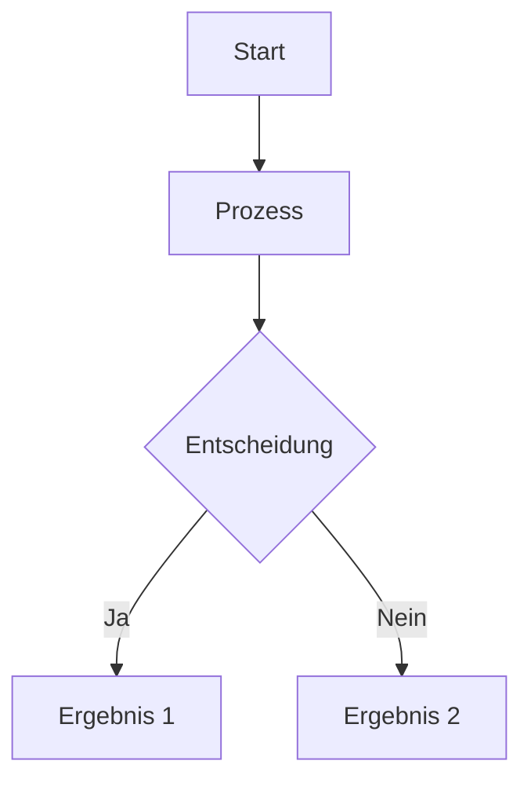
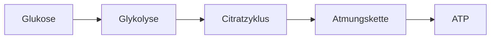

# Content Templates

Diese Templates helfen beim Erstellen neuer Lerninhalte mit korrekter Struktur.

## TL;DR - Quick Reference

**Für Menschen:** Passende Vorlage kopieren, anpassen, validieren.
**Für AI-Agents:** Nutze exakt diese Strukturen für Content-Generierung.

### Template-Übersicht

| Typ                 | Verwendung                  | Link                                                           |
| ------------------- | --------------------------- | -------------------------------------------------------------- |
| Modul-Metadaten     | `module.md` im Modul-Ordner | [→ Vorlage](#modul-metadaten-modulemd)                         |
| Quiz-Frage (single) | `questions/NN-name.md`      | [→ Vorlage](#einfache-multiple-choice-eine-richtige-antwort)   |
| Quiz-Frage (multi)  | `questions/NN-name.md`      | [→ Vorlage](#multiple-choice-mit-mehreren-richtigen-antworten) |
| Self-Assessment     | `lecture-items/NN-name.md`  | [→ Vorlage](#self-assessment-in-lecturemd)                     |
| Lerninhalt (Text)   | `lecture-items/NN-name.md`  | [→ Vorlage](#learning-content-in-lecturemd)                    |
| YouTube Video       | `lecture-items/NN-name.md`  | [→ Vorlage](#youtube-video-in-lecturemd)                       |
| External Video      | `lecture-items/NN-name.md`  | [→ Vorlage](#external-video-in-lecturemd)                      |
| Bild                | `lecture-items/NN-name.md`  | [→ Vorlage](#image-in-lecturemd)                               |
| Mermaid Diagramm    | `lecture-items/NN-name.md`  | [→ Vorlage](#mermaid-diagram-in-lecturemd)                     |

### Kritische YAML-Regeln

```yaml
# ✅ RICHTIG - Bindestrich mit 2 Leerzeichen Einrückung
options:
  - 'Option 1'
  - 'Option 2'

# ❌ FALSCH - Asterisk oder keine Einrückung
options:
* 'Option 1'      # Falsch: Asterisk
- 'Option 2'      # Falsch: Keine Einrückung
```

**Goldene Regel:** `correctAnswer` muss EXAKT mit einer Option übereinstimmen!

→ [Häufige Fehler](#häufige-fehler) | [Validierung](#validierung)

---

## Modul-Metadaten (module.md)

Jeder Modul-Ordner muss eine `module.md` enthalten:

```markdown
---
id: '01-ernaehrungslehre-grundlagen'
title: 'Grundlagen der Ernährungslehre'
ects: 6
status: 'freigeschaltet'
order: 1
description: 'Einführung in die Grundlagen der Ernährungswissenschaft'
---

# Grundlagen der Ernährungslehre

Dieses Modul vermittelt die Grundlagen...

## Lernziele

- Lernziel 1
- Lernziel 2

## Voraussetzungen

Keine - dies ist ein Einstiegsmodul.
```

**Pflichtfelder:**

| Feld          | Typ    | Beschreibung                                       |
| ------------- | ------ | -------------------------------------------------- |
| `id`          | String | Eindeutige ID (sollte dem Ordnernamen entsprechen) |
| `title`       | String | Anzeigename des Moduls                             |
| `ects`        | Number | ECTS-Punkte                                        |
| `status`      | String | `'freigeschaltet'` oder `'gesperrt'`               |
| `order`       | Number | Reihenfolge in der Modulübersicht (1, 2, 3...)     |
| `description` | String | Kurzbeschreibung für die Modulübersicht            |

**Automatisch erkannt (nicht manuell pflegen!):**

- `lectures`: Alle Unterordner mit `lecture.md`
- `achievements`: Alle Dateien im `achievements/` Ordner

## Quiz-Frage (quiz.md)

### Einfache Multiple-Choice (eine richtige Antwort)

```markdown
---
type: 'multiple-choice'
question: 'Was ist ...?'
options:
  - 'Falsche Antwort 1'
  - 'Richtige Antwort'
  - 'Falsche Antwort 2'
  - 'Falsche Antwort 3'
correctAnswer: 'Richtige Antwort'
---
```

### Multiple-Choice mit mehreren richtigen Antworten

```markdown
---
type: 'multiple-choice-multiple'
question: 'Welche der folgenden Aussagen sind korrekt? (Mehrfachauswahl möglich)'
options:
  - 'Richtige Aussage 1'
  - 'Falsche Aussage'
  - 'Richtige Aussage 2'
  - 'Richtige Aussage 3'
correctAnswers:
  - 'Richtige Aussage 1'
  - 'Richtige Aussage 2'
  - 'Richtige Aussage 3'
---

**Erklärung:** Detaillierte Erklärung, warum diese Antworten richtig sind.
```

**Wichtig:**

- `options:` muss eine Liste mit `-` (Bindestrich) und 2 Leerzeichen Einrückung sein
- Niemals `*` (Stern) für Listen verwenden!
- Einfache MC: `correctAnswer` (Singular) - genau eine richtige Antwort
- Multiple MC: `correctAnswers` (Plural) - eine oder mehrere richtige Antworten
- Alle `correctAnswers` müssen exakt mit Optionen übereinstimmen
- Mindestens 2 Optionen erforderlich
- Bei Multiple MC können auch alle Optionen richtig sein

## Self-Assessment (in lecture.md)

```markdown
---
type: 'self-assessment-mc'
topic: 'Thema der Vorlesung'
question: 'Testfrage zum Verständnis?'
options:
  - 'Antwort A'
  - 'Antwort B'
  - 'Antwort C'
  - 'Antwort D'
correctAnswer: 'Antwort B'
---

**Erklärung:** Detaillierte Erklärung, warum diese Antwort richtig ist.
```

## Learning Content (in lecture.md)

```markdown
---
type: 'learning-content'
---

## Überschrift

Normaler Markdown-Inhalt mit Text, Listen, etc.

- Listenpunkt 1
- Listenpunkt 2

**Fett** und *kursiv* formatierter Text.
```

## YouTube Video (in lecture.md)

```markdown
---
type: 'youtube-video'
url: 'https://www.youtube.com/watch?v=VIDEO_ID'
title: 'Video-Titel (optional)'
---
```

**Wichtig:**

- URL muss vollständige YouTube-URL sein (mit `watch?v=`)
- Kurz-URLs (youtu.be) werden auch unterstützt
- Video wird responsive eingebettet (16:9 Seitenverhältnis)

## External Video (in lecture.md)

Für externe Videos, die Login erfordern (z.B. Moodle, LMS):

```markdown
---
type: 'external-video'
url: 'https://moodle.univie.ac.at/mod/page/view.php?id=12345'
title: 'Vorlesung 1: Materie und Messen'
description: 'Öffnet die Uni-Wien Moodle-Seite (Login erforderlich)'
duration: '45 min'
---
```

**Felder:**

| Feld          | Pflicht | Beschreibung                                           |
| ------------- | ------- | ------------------------------------------------------ |
| `type`        | Ja      | Muss `'external-video'` sein                           |
| `url`         | Ja      | Vollständige URL zum externen Video                    |
| `title`       | Nein    | Titel des Videos (Standard: "Externes Video")          |
| `description` | Nein    | Beschreibung/Hinweis (Standard: "Öffnet in neuem Tab") |
| `duration`    | Nein    | Geschätzte Dauer (z.B. "45 min")                       |

**Wichtig:**

- Link öffnet in neuem Tab
- Benutzer wird aufgefordert, nach dem Ansehen zurückzukehren
- Ideal für Uni-Videos, die Authentifizierung erfordern

## Image (in lecture.md)

```markdown
---
type: 'image'
url: 'https://example.com/path/to/image.png'
alt: 'Beschreibung des Bildes für Screenreader'
caption: 'Optionale Bildunterschrift (optional)'
title: 'Bildtitel (optional)'
---
```

**Wichtig:**

- `url` kann remote URL oder lokaler Pfad sein
- `alt` ist Pflichtfeld für Barrierefreiheit
- Bild wird zentriert und responsive dargestellt
- Unterstützte Formate: PNG, JPG, GIF, SVG, WebP

## Mermaid Diagram (in lecture.md)

```markdown
---
type: 'mermaid-diagram'
title: 'Diagramm-Titel (optional)'
---


**Wichtig:**

- Mermaid-Code muss in \`\`\`mermaid Code-Block eingeschlossen sein
- Unterstützt: Flowcharts, Sequence Diagrams, Class Diagrams, etc.
- Siehe [Mermaid Dokumentation](https://mermaid.js.org/) für Syntax
- Diagramme werden automatisch gerendert

**Beispiel Flowchart:**

```markdown
---
type: 'mermaid-diagram'
title: 'Zellatmung Übersicht'
---


## Vollständige Vorlesung (lecture.md)

```markdown
---
type: 'learning-content'
---

## Hauptthema

Einführungstext zum Thema.

### Unterthema 1

Detaillierter Inhalt...

---
type: 'self-assessment-mc'
topic: 'Hauptthema'
question: 'Verständnisfrage?'
options:
  - 'Option 1'
  - 'Option 2'
  - 'Option 3'
  - 'Option 4'
correctAnswer: 'Option 2'
---

**Erklärung:** Warum Option 2 korrekt ist.

---
type: 'learning-content'
---

### Unterthema 2

Weiterer Inhalt...
```

## Häufige Fehler

### ❌ FALSCH - Sterne statt Bindestriche

```yaml
options:

* 'Option 1'
* 'Option 2'
```

### ✅ RICHTIG - Bindestriche mit Einrückung

```yaml
options:
  - 'Option 1'
  - 'Option 2'
```

### ❌ FALSCH - Fehlende Einrückung

```yaml
options:
- 'Option 1'
- 'Option 2'
```

### ✅ RICHTIG - 2 Leerzeichen Einrückung

```yaml
options:
  - 'Option 1'
  - 'Option 2'
```

### ❌ FALSCH - correctAnswer stimmt nicht überein

```yaml
options:
  - 'Die Antwort'
  - 'Andere Antwort'
correctAnswer: 'Die richtige Antwort'  # Nicht in der Liste!
```

### ✅ RICHTIG - Exakte Übereinstimmung

```yaml
options:
  - 'Die Antwort'
  - 'Andere Antwort'
correctAnswer: 'Die Antwort'
```

## Validierung

Vor dem Commit immer validieren:

```bash
node validate-content.js
```

Oder in VS Code: `Cmd+Shift+P` → "Run Task" → "Validate Content"
