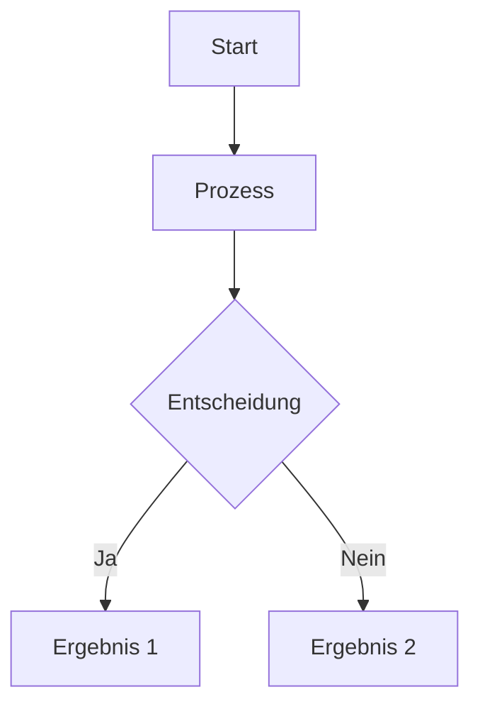
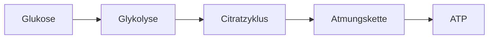

# Content Templates

Diese Templates helfen beim Erstellen neuer Lerninhalte mit korrekter Struktur.

## Quiz-Frage (quiz.md)

```markdown
---
type: 'multiple-choice'
question: 'Was ist ...?'
options:
  - 'Falsche Antwort 1'
  - 'Richtige Antwort'
  - 'Falsche Antwort 2'
  - 'Falsche Antwort 3'
correctAnswer: 'Richtige Antwort'
---
```

**Wichtig:**

- `options:` muss eine Liste mit `-` (Bindestrich) und 2 Leerzeichen Einrückung sein
- Niemals `*` (Stern) für Listen verwenden!
- `correctAnswer` muss exakt mit einer Option übereinstimmen
- Mindestens 2 Optionen erforderlich

## Self-Assessment (in lecture.md)

```markdown
---
type: 'self-assessment-mc'
topic: 'Thema der Vorlesung'
question: 'Testfrage zum Verständnis?'
options:
  - 'Antwort A'
  - 'Antwort B'
  - 'Antwort C'
  - 'Antwort D'
correctAnswer: 'Antwort B'
---

**Erklärung:** Detaillierte Erklärung, warum diese Antwort richtig ist.
```

## Learning Content (in lecture.md)

```markdown
---
type: 'learning-content'
---

## Überschrift

Normaler Markdown-Inhalt mit Text, Listen, etc.

- Listenpunkt 1
- Listenpunkt 2

**Fett** und *kursiv* formatierter Text.
```

## YouTube Video (in lecture.md)

```markdown
---
type: 'youtube-video'
url: 'https://www.youtube.com/watch?v=VIDEO_ID'
title: 'Video-Titel (optional)'
---
```

**Wichtig:**

- URL muss vollständige YouTube-URL sein (mit `watch?v=`)
- Kurz-URLs (youtu.be) werden auch unterstützt
- Video wird responsive eingebettet (16:9 Seitenverhältnis)

## Image (in lecture.md)

```markdown
---
type: 'image'
url: 'https://example.com/path/to/image.png'
alt: 'Beschreibung des Bildes für Screenreader'
caption: 'Optionale Bildunterschrift (optional)'
title: 'Bildtitel (optional)'
---
```

**Wichtig:**

- `url` kann remote URL oder lokaler Pfad sein
- `alt` ist Pflichtfeld für Barrierefreiheit
- Bild wird zentriert und responsive dargestellt
- Unterstützte Formate: PNG, JPG, GIF, SVG, WebP

## Mermaid Diagram (in lecture.md)

```markdown
---
type: 'mermaid-diagram'
title: 'Diagramm-Titel (optional)'
---


**Wichtig:**

- Mermaid-Code muss in \`\`\`mermaid Code-Block eingeschlossen sein
- Unterstützt: Flowcharts, Sequence Diagrams, Class Diagrams, etc.
- Siehe [Mermaid Dokumentation](https://mermaid.js.org/) für Syntax
- Diagramme werden automatisch gerendert

**Beispiel Flowchart:**
```markdown
---
type: 'mermaid-diagram'
title: 'Zellatmung Übersicht'
---


## Vollständige Vorlesung (lecture.md)

```markdown
---
type: 'learning-content'
---

## Hauptthema

Einführungstext zum Thema.

### Unterthema 1

Detaillierter Inhalt...

---
type: 'self-assessment-mc'
topic: 'Hauptthema'
question: 'Verständnisfrage?'
options:
  - 'Option 1'
  - 'Option 2'
  - 'Option 3'
  - 'Option 4'
correctAnswer: 'Option 2'
---

**Erklärung:** Warum Option 2 korrekt ist.

---
type: 'learning-content'
---

### Unterthema 2

Weiterer Inhalt...
```

## Häufige Fehler

### ❌ FALSCH - Sterne statt Bindestriche

```yaml
options:

* 'Option 1'
* 'Option 2'
```

### ✅ RICHTIG - Bindestriche mit Einrückung

```yaml
options:
  - 'Option 1'
  - 'Option 2'
```

### ❌ FALSCH - Fehlende Einrückung

```yaml
options:
- 'Option 1'
- 'Option 2'
```

### ✅ RICHTIG - 2 Leerzeichen Einrückung

```yaml
options:
  - 'Option 1'
  - 'Option 2'
```

### ❌ FALSCH - correctAnswer stimmt nicht überein

```yaml
options:
  - 'Die Antwort'
  - 'Andere Antwort'
correctAnswer: 'Die richtige Antwort'  # Nicht in der Liste!
```

### ✅ RICHTIG - Exakte Übereinstimmung

```yaml
options:
  - 'Die Antwort'
  - 'Andere Antwort'
correctAnswer: 'Die Antwort'
```

## Validierung

Vor dem Commit immer validieren:

```bash
node validate-content.js
```

Oder in VS Code: `Cmd+Shift+P` → "Run Task" → "Validate Content"
