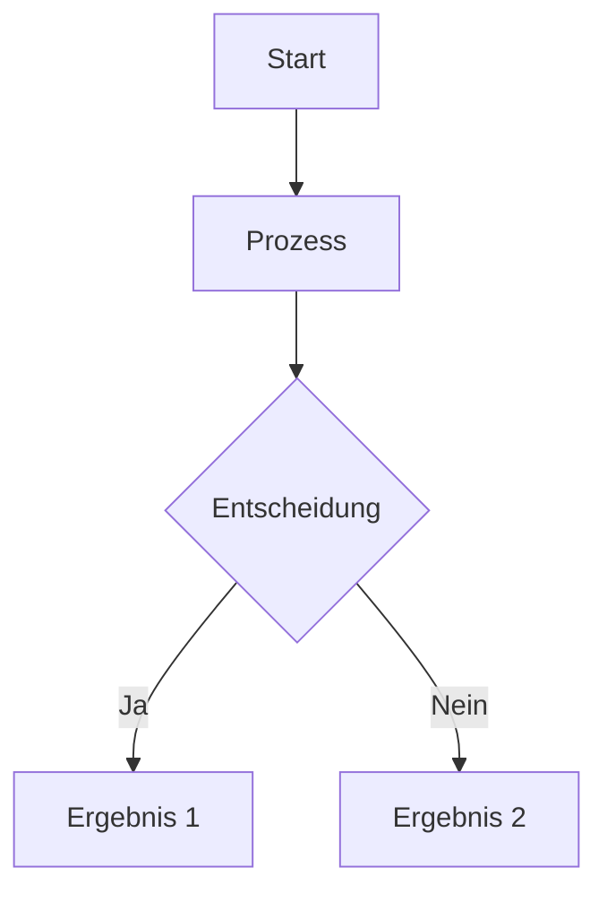
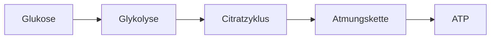

# Content Templates

Diese Templates helfen beim Erstellen neuer Lerninhalte mit korrekter Struktur.

## TL;DR - Quick Reference

**Für Menschen:** Passende Vorlage kopieren, anpassen, validieren.
**Für AI-Agents:** Nutze exakt diese Strukturen für Content-Generierung.

### Template-Übersicht

| Typ                 | Verwendung                  | Link                                                           |
| ------------------- | --------------------------- | -------------------------------------------------------------- |
| Modul-Metadaten     | `module.md` im Modul-Ordner | [→ Vorlage](#modul-metadaten-modulemd)                         |
| Achievement         | `achievements/NN-name.md`   | [→ Vorlage](#achievement-cheat-sheet)                          |
| Quiz-Frage (single) | `questions/NN-name.md`      | [→ Vorlage](#einfache-multiple-choice-eine-richtige-antwort)   |
| Quiz-Frage (multi)  | `questions/NN-name.md`      | [→ Vorlage](#multiple-choice-mit-mehreren-richtigen-antworten) |
| Self-Assessment     | `lecture-items/NN-name.md`  | [→ Vorlage](#self-assessment-in-lecturemd)                     |
| Lerninhalt (Text)   | `lecture-items/NN-name.md`  | [→ Vorlage](#learning-content-in-lecturemd)                    |
| YouTube Video       | `lecture-items/NN-name.md`  | [→ Vorlage](#youtube-video-in-lecturemd)                       |
| External Video      | `lecture-items/NN-name.md`  | [→ Vorlage](#external-video-in-lecturemd)                      |
| Bild                | `lecture-items/NN-name.md`  | [→ Vorlage](#image-in-lecturemd)                               |
| Mermaid Diagramm    | `lecture-items/NN-name.md`  | [→ Vorlage](#mermaid-diagram-in-lecturemd)                     |
| Balance Equation    | `lecture-items/NN-name.md`  | [→ Vorlage](#balance-equation-in-lecturemd)                    |

### Kritische YAML-Regeln

```yaml
# ✅ RICHTIG - Bindestrich mit 2 Leerzeichen Einrückung
options:
  - 'Option 1'
  - 'Option 2'

# ❌ FALSCH - Asterisk oder keine Einrückung
options:
* 'Option 1'      # Falsch: Asterisk
- 'Option 2'      # Falsch: Keine Einrückung
```

**Goldene Regeln:**
- `correctAnswer` muss EXAKT mit einer Option übereinstimmen!
- ⚠️ **NIEMALS `---` im Markdown-Content verwenden!** Der Parser interpretiert `---` als YAML-Dokumententrenner. Für horizontale Linien stattdessen `***` oder einfach Leerzeilen nutzen.

→ [Häufige Fehler](#häufige-fehler) | [Validierung](#validierung)

---

## Modul-Metadaten (module.md)

Jeder Modul-Ordner muss eine `module.md` enthalten:

```markdown
---
id: '01-ernaehrungslehre-grundlagen'
title: 'Grundlagen der Ernährungslehre'
ects: 6
status: 'freigeschaltet'
order: 1
description: 'Einführung in die Grundlagen der Ernährungswissenschaft'
---

# Grundlagen der Ernährungslehre

Dieses Modul vermittelt die Grundlagen...

## Lernziele

- Lernziel 1
- Lernziel 2

## Voraussetzungen

Keine - dies ist ein Einstiegsmodul.
```

**Pflichtfelder:**

| Feld          | Typ    | Beschreibung                                       |
| ------------- | ------ | -------------------------------------------------- |
| `id`          | String | Eindeutige ID (sollte dem Ordnernamen entsprechen) |
| `title`       | String | Anzeigename des Moduls                             |
| `ects`        | Number | ECTS-Punkte                                        |
| `status`      | String | `'freigeschaltet'` oder `'gesperrt'`               |
| `order`       | Number | Reihenfolge in der Modulübersicht (1, 2, 3...)     |
| `description` | String | Kurzbeschreibung für die Modulübersicht            |

**Automatisch erkannt (nicht manuell pflegen!):**

- `lectures`: Alle Unterordner mit `lecture.md`
- `achievements`: Alle Dateien im `achievements/` Ordner

## Achievement (Cheat-Sheet)

Achievements werden freigeschaltet, wenn der Benutzer ein Quiz mit Gold-Status (≥90%) besteht. Sie enthalten nützliche Zusammenfassungen.

**Speicherort:** `content/{studyId}/NN-modul/achievements/NN-name.md`

### ⚠️ WICHTIG: Cheat-Sheet Content-Richtlinien

Cheat-Sheets sollen **NUR kompakte Lerninhalte** enthalten. **VERBOTEN** sind:

- ❌ Gratulationstexte ("Herzlichen Glückwunsch!", "Du hast es geschafft!")
- ❌ Einleitungstexte ("Hier ist deine Zusammenfassung...")
- ❌ Tipps zum Ausdrucken ("💡 Tipp: Drucke dieses Cheat-Sheet aus...")
- ❌ Gültigkeitshinweise ("🔄 Gültig für: 30 Tage...")
- ❌ Nächste-Schritte-Abschnitte ("📌 Nächste Schritte: ...")
- ❌ Jeglicher Meta-Text über das Achievement selbst

**Der Titel** wird automatisch im Modal-Header angezeigt – er sollte aber auch als `# Titel` im Markdown stehen, damit er bei Export/Druck erscheint.

```markdown
---
type: 'achievement'
id: 'thema-cheatsheet'
title: 'Thema Cheat-Sheet'
description: 'Kompakte Zusammenfassung aller wichtigen Konzepte'
icon: 'clipboard'
contentType: 'markdown'
unlockCondition:
  type: 'lecture-quiz-gold'
  lectureId: '01-thema'
  moduleId: '01-modul-name'
defaultDuration: 30
extensionDuration: 14
warningThreshold: 7
---

# Thema – Cheat-Sheet

## Abschnitt 1

Inhalt hier...

## Abschnitt 2

Weiterer Inhalt...
```

**Pflichtfelder im Frontmatter:**

| Feld                | Typ    | Beschreibung                                      |
| ------------------- | ------ | ------------------------------------------------- |
| `type`              | String | Immer `'achievement'`                             |
| `id`                | String | Eindeutige ID (z.B. `'zellbiologie-cheatsheet'`)  |
| `title`             | String | Anzeigename                                       |
| `description`       | String | Kurzbeschreibung                                  |
| `icon`              | String | Icon-Name (siehe gültige Icons unten)             |
| `contentType`       | String | Immer `'markdown'`                                |
| `unlockCondition`   | Object | Bedingung zum Freischalten (siehe unten)          |
| `defaultDuration`   | Number | Gültigkeitsdauer in Tagen (Standard: 30)          |
| `extensionDuration` | Number | Verlängerung bei korrekter Antwort (Standard: 14) |
| `warningThreshold`  | Number | Tage vor Ablauf für Warnung (Standard: 7)         |

**Gültige Icon-Namen:**

`search`, `menuDots`, `sun`, `moon`, `close`, `modules`, `chart`, `cog`, `map`, `trophy`, `achievement`, `phone`, `phoneDownload`, `checkCircle`, `book`, `zoomIn`, `zoomOut`, `reset`, `externalLink`, `lock`, `unlock`, `clock`, `hourglass`, `document`, `clipboard`, `apple`, `beaker`, `graduationCap`, `download`, `upload`, `hourglassEmpty`, `check`, `rocket`, `fire`, `muscle`, `star`, `wave`

⚠️ **Hinweis:** `atom` ist KEIN gültiger Icon-Name! Für Chemie-Inhalte `beaker` verwenden.

**unlockCondition-Objekt:**

```yaml
unlockCondition:
  type: 'lecture-quiz-gold'
  lectureId: '01-thema'        # ID der Vorlesung
  moduleId: '01-modul-name'    # ID des Moduls
```

⚠️ **WICHTIG für den Markdown-Content:**

- **NIEMALS `---` als horizontale Linie verwenden!** Der Parser interpretiert `---` als YAML-Dokumententrenner.
- Für visuelle Trennung: `***` verwenden oder einfach Leerzeilen und `##` Überschriften.

## Vorlesungs-Metadaten (lecture.md)

```markdown
---
topic: 'Materie und Messen'
description: 'Einführung in Chemie, Atome und Messgrößen'
estimatedTime: 45
sources:
  - id: 'vorlesung-k1'
    title: 'Vorlesungsfolien Kapitel 1 (WS2025)'
    url: 'https://moodle.univie.ac.at/path/to/Kapitel1.pdf'
    type: 'pdf'
  - id: 'mortimer'
    title: 'Mortimer & Müller: Chemie - Das Basiswissen (10. Aufl.)'
    url: null
    type: 'book'
---

# Materie und Messen

Kurze Einleitung oder Lernziele.
```

**Pflichtfelder:**

| Feld          | Typ    | Beschreibung                             |
| ------------- | ------ | ---------------------------------------- |
| `topic`       | String | Titel der Vorlesung                      |
| `description` | String | Kurzbeschreibung für die Vorlesungsliste |

**Optionale Felder:**

| Feld            | Typ    | Beschreibung                    |
| --------------- | ------ | ------------------------------- |
| `estimatedTime` | Number | Geschätzte Lernzeit in Minuten  |
| `sources`       | Array  | Quellenreferenzen (siehe unten) |

**Source-Objekte:**

| Feld    | Typ    | Beschreibung                              |
| ------- | ------ | ----------------------------------------- |
| `id`    | String | Eindeutige ID für Referenzierung in Items |
| `title` | String | Anzeigename der Quelle                    |
| `url`   | String | Link zur Quelle (oder `null` bei Büchern) |
| `type`  | String | `'pdf'`, `'book'`, `'video'`, `'website'` |

## Quiz-Frage (quiz.md)

### Einfache Multiple-Choice (eine richtige Antwort)

```markdown
---
type: 'multiple-choice'
question: 'Was ist ...?'
options:
  - 'Falsche Antwort 1'
  - 'Richtige Antwort'
  - 'Falsche Antwort 2'
  - 'Falsche Antwort 3'
correctAnswer: 'Richtige Antwort'
---
```

### Multiple-Choice mit mehreren richtigen Antworten

```markdown
---
type: 'multiple-choice-multiple'
question: 'Welche der folgenden Aussagen sind korrekt? (Mehrfachauswahl möglich)'
options:
  - 'Richtige Aussage 1'
  - 'Falsche Aussage'
  - 'Richtige Aussage 2'
  - 'Richtige Aussage 3'
correctAnswers:
  - 'Richtige Aussage 1'
  - 'Richtige Aussage 2'
  - 'Richtige Aussage 3'
---

**Erklärung:** Detaillierte Erklärung, warum diese Antworten richtig sind.
```

**Wichtig:**

- `options:` muss eine Liste mit `-` (Bindestrich) und 2 Leerzeichen Einrückung sein
- Niemals `*` (Stern) für Listen verwenden!
- Einfache MC: `correctAnswer` (Singular) - genau eine richtige Antwort
- Multiple MC: `correctAnswers` (Plural) - eine oder mehrere richtige Antworten
- Alle `correctAnswers` müssen exakt mit Optionen übereinstimmen
- Mindestens 2 Optionen erforderlich
- Bei Multiple MC können auch alle Optionen richtig sein

## Self-Assessment (in lecture.md)

```markdown
---
type: 'self-assessment-mc'
topic: 'Thema der Vorlesung'
question: 'Testfrage zum Verständnis?'
options:
  - 'Antwort A'
  - 'Antwort B'
  - 'Antwort C'
  - 'Antwort D'
correctAnswer: 'Antwort B'
---

**Erklärung:** Detaillierte Erklärung, warum diese Antwort richtig ist.
```

### Self-Assessment Checkliste (ohne Quiz)

Für Selbsteinschätzungen am Ende eines Themenblocks, bei denen Studierende ihren Lernfortschritt selbst überprüfen:

```markdown
---
type: 'self-assessment'
topic: 'Thema der Vorlesung'
question: 'Kannst du die wichtigsten Konzepte erklären?'
checkpoints:
  - 'Ich kann Konzept A erklären'
  - 'Ich verstehe den Unterschied zwischen X und Y'
  - 'Ich kann Beispiele für Z nennen'
successMessage: 'Sehr gut! Du hast dieses Thema verstanden.'
reviewHint: 'Falls du unsicher bist, lies den Abschnitt noch einmal durch.'
---
```

**Felder:**

| Feld             | Typ    | Pflicht | Beschreibung                                   |
| ---------------- | ------ | ------- | ---------------------------------------------- |
| `type`           | String | ✓       | `'self-assessment'`                            |
| `question`       | String | ✓       | Hauptfrage für die Selbsteinschätzung          |
| `checkpoints`    | Array  | ✓       | Liste von Aussagen zum Abhaken                 |
| `topic`          | String |         | Themenbereich                                  |
| `successMessage` | String |         | Nachricht bei vollständigem Abhaken            |
| `reviewHint`     | String |         | Hinweis, falls nicht alle Punkte abgehakt sind |

## Neue Interaktive Typen (V4)

### Fill-in-the-Blank (Lückentext)

Lückentexte zum Ausfüllen von Formeln oder Konzepten:

```markdown
---
type: 'fill-in-the-blank'
topic: 'Wärmeberechnung'
question: 'Vervollständige die Formel zur Wärmeberechnung'
text: 'Die Formel lautet: q = {{blank1}} · {{blank2}} · {{blank3}}'
blanks:
  - id: 'blank1'
    answer: 'm'
    alternatives:
      - 'Masse'
    hint: 'Die Stoffmenge in Gramm'
  - id: 'blank2'
    answer: 'c'
    alternatives:
      - 'spezifische Wärmekapazität'
    hint: 'Die stoffspezifische Konstante'
  - id: 'blank3'
    answer: 'ΔT'
    alternatives:
      - 'Delta T'
      - 'Temperaturdifferenz'
    hint: 'Die Änderung einer Zustandsgröße'
---
```

**Felder:**

| Feld       | Typ    | Pflicht | Beschreibung                           |
| ---------- | ------ | ------- | -------------------------------------- |
| `type`     | String | ✓       | `'fill-in-the-blank'`                  |
| `question` | String | ✓       | Aufgabenstellung                       |
| `text`     | String | ✓       | Text mit `{{blankId}}` Platzhaltern    |
| `blanks`   | Array  | ✓       | Liste der Lücken mit id, answer, hints |
| `topic`    | String |         | Themenbereich                          |

**Blank-Objekt:**

| Feld           | Typ    | Pflicht | Beschreibung                         |
| -------------- | ------ | ------- | ------------------------------------ |
| `id`           | String | ✓       | Eindeutige ID (referenziert im Text) |
| `answer`       | String | ✓       | Richtige Antwort                     |
| `alternatives` | Array  |         | Akzeptierte Alternativantworten      |
| `hint`         | String |         | Hinweis für den Nutzer               |

### Matching (Zuordnung)

Zuordnungsaufgaben für Begriffe und Definitionen:

```markdown
---
type: 'matching'
topic: 'Thermodynamik Grundbegriffe'
question: 'Ordne die Begriffe den richtigen Definitionen zu'
pairs:
  - term: 'Exotherm'
    match: 'Wärme wird an die Umgebung abgegeben'
  - term: 'Endotherm'
    match: 'Wärme wird aus der Umgebung aufgenommen'
  - term: 'Enthalpie'
    match: 'Wärmeinhalt bei konstantem Druck'
  - term: 'Innere Energie'
    match: 'Summe aus potentieller und kinetischer Energie'
---
```

**Felder:**

| Feld       | Typ    | Pflicht | Beschreibung              |
| ---------- | ------ | ------- | ------------------------- |
| `type`     | String | ✓       | `'matching'`              |
| `question` | String | ✓       | Aufgabenstellung          |
| `pairs`    | Array  | ✓       | Liste der Zuordnungspaare |
| `topic`    | String |         | Themenbereich             |

**Pair-Objekt:**

| Feld    | Typ    | Pflicht | Beschreibung             |
| ------- | ------ | ------- | ------------------------ |
| `term`  | String | ✓       | Begriff (linke Seite)    |
| `match` | String | ✓       | Zuordnung (rechte Seite) |

### Ordering (Sortierung)

Sortieraufgaben für Reihenfolgen:

```markdown
---
type: 'ordering'
topic: 'Heizkurve'
question: 'Bringe die Schritte der Heizkurve von Wasser in die richtige Reihenfolge'
items:
  - 'Eis erwärmen (-20°C bis 0°C)'
  - 'Eis schmelzen (bei 0°C)'
  - 'Wasser erwärmen (0°C bis 100°C)'
  - 'Wasser verdampfen (bei 100°C)'
  - 'Dampf erwärmen (über 100°C)'
explanation: 'Die Heizkurve beginnt beim kältesten Zustand. Bei Phasenübergängen bleibt die Temperatur konstant.'
---
```

**Felder:**

| Feld          | Typ    | Pflicht | Beschreibung                    |
| ------------- | ------ | ------- | ------------------------------- |
| `type`        | String | ✓       | `'ordering'`                    |
| `question`    | String | ✓       | Aufgabenstellung                |
| `items`       | Array  | ✓       | Liste in RICHTIGER Reihenfolge! |
| `topic`       | String |         | Themenbereich                   |
| `explanation` | String |         | Erklärung nach korrekter Lösung |

⚠️ **Wichtig:** Die `items` müssen in der RICHTIGEN Reihenfolge angegeben werden. Die App mischt sie automatisch für den Nutzer.

### Calculation (Berechnung)

Berechnungsaufgaben mit Eingabefeld:

```markdown
---
type: 'calculation'
topic: 'Wärmeberechnung'
question: 'Berechne die Wärme, die benötigt wird um 50g Wasser von 20°C auf 80°C zu erwärmen.'
variables:
  m: '50 g'
  c: '4,184 J/(g·K)'
  ΔT: '60 K'
formula: 'q = m · c · ΔT'
correctAnswer: 12552
unit: 'J'
tolerance: 10
hints:
  - 'Setze die Werte in die Formel ein'
  - 'q = 50 · 4,184 · 60'
explanation: 'Die Berechnung ergibt: 50 × 4,184 × 60 = 12.552 J'
---
```

**Felder:**

| Feld            | Typ    | Pflicht | Beschreibung                 |
| --------------- | ------ | ------- | ---------------------------- |
| `type`          | String | ✓       | `'calculation'`              |
| `question`      | String | ✓       | Aufgabenstellung             |
| `correctAnswer` | Number | ✓       | Richtige Antwort (numerisch) |
| `unit`          | String | ✓       | Einheit der Antwort          |
| `topic`         | String |         | Themenbereich                |
| `variables`     | Object |         | Gegebene Werte (key: value)  |
| `formula`       | String |         | Anzuwendende Formel          |
| `tolerance`     | Number |         | Erlaubte Abweichung (±)      |
| `hints`         | Array  |         | Schrittweise Hinweise        |
| `explanation`   | String |         | Erklärung nach Lösung        |

### Practice-Exercise (Praxis-Übung)

Komplexe Praxis-Übungen mit mehreren Teilaufgaben:

```markdown
---
type: 'practice-exercise'
topic: 'Thermodynamik im Alltag'
title: 'Energieberechnung am Beispiel Kaffee'
scenario: 'Du erhitzt 250 ml Wasser (≈ 250g) für einen Kaffee von 20°C auf 95°C.'
tasks:
  - question: 'Wie viel Energie wird benötigt?'
    type: 'calculation'
    correctAnswer: 78450
    unit: 'J'
  - question: 'Ist dieser Vorgang exotherm oder endotherm?'
    type: 'multiple-choice'
    options:
      - 'Exotherm'
      - 'Endotherm'
    correctAnswer: 'Endotherm'
  - question: 'Wie viele kcal entspricht das?'
    type: 'calculation'
    correctAnswer: 18.75
    unit: 'kcal'
    tolerance: 0.5
realWorldConnection: 'Diese Energie entspricht etwa 19 kcal - weniger als ein Stück Würfelzucker!'
---
```

**Felder:**

| Feld                  | Typ    | Pflicht | Beschreibung               |
| --------------------- | ------ | ------- | -------------------------- |
| `type`                | String | ✓       | `'practice-exercise'`      |
| `title`               | String | ✓       | Titel der Übung            |
| `scenario`            | String | ✓       | Beschreibung der Situation |
| `tasks`               | Array  | ✓       | Liste der Teilaufgaben     |
| `topic`               | String |         | Themenbereich              |
| `realWorldConnection` | String |         | Alltagsbezug als Abschluss |

**Task-Objekt:**

| Feld            | Typ    | Pflicht | Beschreibung                             |
| --------------- | ------ | ------- | ---------------------------------------- |
| `question`      | String | ✓       | Teilfrage                                |
| `type`          | String | ✓       | `'calculation'` oder `'multiple-choice'` |
| `correctAnswer` | Any    | ✓       | Richtige Antwort (Zahl oder String)      |
| `unit`          | String |         | Einheit (bei calculation)                |
| `options`       | Array  |         | Optionen (bei multiple-choice)           |
| `tolerance`     | Number |         | Erlaubte Abweichung (bei calculation)    |

## Learning Content (in lecture.md)

### Einfacher Lerninhalt

```markdown
---
type: 'learning-content'
topic: 'Themenbereich'
---

## Überschrift

Normaler Markdown-Inhalt mit Text, Listen, etc.

- Listenpunkt 1
- Listenpunkt 2

**Fett** und *kursiv* formatierter Text.
```

### Lerninhalt mit Quellenreferenz

```markdown
---
type: 'learning-content'
topic: 'Einführung in die Chemie'
sourceRefs:
  - sourceId: 'vorlesung-k1'
    pages: '23-25'
---

## Was ist Chemie?

Inhalt basierend auf der Originalquelle...
```

### Lerninhalt mit mehreren Quellen

```markdown
---
type: 'learning-content'
topic: 'Periodensystem'
sourceRefs:
  - sourceId: 'vorlesung-k1'
    pages: '71, 73, 76'
  - sourceId: 'mortimer'
    pages: '45-48'
---

## Das Periodensystem der Elemente

Inhalt mit Referenzen zu verschiedenen Quellen...
```

**SourceRef-Felder:**

| Feld       | Typ    | Beschreibung                                        |
| ---------- | ------ | --------------------------------------------------- |
| `sourceId` | String | ID einer Quelle aus `sources` in `lecture.md`       |
| `pages`    | String | Seitenangabe(n), z.B. `'23-25'` oder `'71, 73, 76'` |

## YouTube Video (in lecture.md)

```markdown
---
type: 'youtube-video'
url: 'https://www.youtube.com/watch?v=VIDEO_ID'
title: 'Video-Titel (optional)'
---
```

**Wichtig:**

- URL muss vollständige YouTube-URL sein (mit `watch?v=`)
- Kurz-URLs (youtu.be) werden auch unterstützt
- Video wird responsive eingebettet (16:9 Seitenverhältnis)

## External Video (in lecture.md)

Für externe Videos, die Login erfordern (z.B. Moodle, LMS):

```markdown
---
type: 'external-video'
url: 'https://moodle.univie.ac.at/mod/page/view.php?id=12345'
title: 'Vorlesung 1: Materie und Messen'
description: 'Öffnet die Uni-Wien Moodle-Seite (Login erforderlich)'
duration: '45 min'
---
```

**Felder:**

| Feld          | Pflicht | Beschreibung                                           |
| ------------- | ------- | ------------------------------------------------------ |
| `type`        | Ja      | Muss `'external-video'` sein                           |
| `url`         | Ja      | Vollständige URL zum externen Video                    |
| `title`       | Nein    | Titel des Videos (Standard: "Externes Video")          |
| `description` | Nein    | Beschreibung/Hinweis (Standard: "Öffnet in neuem Tab") |
| `duration`    | Nein    | Geschätzte Dauer (z.B. "45 min")                       |

**Wichtig:**

- Link öffnet in neuem Tab
- Benutzer wird aufgefordert, nach dem Ansehen zurückzukehren
- Ideal für Uni-Videos, die Authentifizierung erfordern

## Image (in lecture.md)

```markdown
---
type: 'image'
url: 'https://example.com/path/to/image.png'
alt: 'Beschreibung des Bildes für Screenreader'
caption: 'Optionale Bildunterschrift (optional)'
title: 'Bildtitel (optional)'
---
```

**Wichtig:**

- `url` kann remote URL oder lokaler Pfad sein
- `alt` ist Pflichtfeld für Barrierefreiheit
- Bild wird zentriert und responsive dargestellt
- Unterstützte Formate: PNG, JPG, GIF, SVG, WebP

## Mermaid Diagram (in lecture.md)

```markdown
---
type: 'mermaid-diagram'
title: 'Diagramm-Titel (optional)'
---


**Wichtig:**

- Mermaid-Code muss in \`\`\`mermaid Code-Block eingeschlossen sein
- Unterstützt: Flowcharts, Sequence Diagrams, Class Diagrams, etc.
- Siehe [Mermaid Dokumentation](https://mermaid.js.org/) für Syntax
- Diagramme werden automatisch gerendert

**Beispiel Flowchart:**

```markdown
---
type: 'mermaid-diagram'
title: 'Zellatmung Übersicht'
---


## Balance Equation (in lecture.md)

Interaktive Übung zum Ausgleichen chemischer Gleichungen:

```markdown
---
type: 'balance-equation'
title: 'Wassersynthese'
reactants:
  - formula: 'H2'
    coefficient: 2
  - formula: 'O2'
    coefficient: 1
products:
  - formula: 'H2O'
    coefficient: 2
hints:
  - 'Zähle zuerst die Sauerstoff-Atome auf beiden Seiten'
  - 'Ein O2-Molekül hat 2 Sauerstoff-Atome'
explanation: 'Die Gleichung ist ausgeglichen: 4 H-Atome und 2 O-Atome auf jeder Seite.'
---
```

**Felder:**

| Feld          | Pflicht | Beschreibung                                       |
| ------------- | ------- | -------------------------------------------------- |
| `type`        | Ja      | Muss `'balance-equation'` sein                     |
| `reactants`   | Ja      | Liste der Edukte mit `formula` und `coefficient`   |
| `products`    | Ja      | Liste der Produkte mit `formula` und `coefficient` |
| `title`       | Nein    | Überschrift der Übung                              |
| `hints`       | Nein    | Liste von Hinweisen (ausklappbar)                  |
| `explanation` | Nein    | Erklärung bei richtiger Lösung                     |

**Formel-Notation:**

- Im YAML: ASCII-Notation verwenden (`H2`, `O2`, `Fe2O3`, `CH4`)
- KaTeX/mhchem rendert automatisch: H2 → H₂, Fe2O3 → Fe₂O₃
- Unterstützt: Subscripts, Ionenladungen (Na+, Cl-), Reaktionspfeile

**Beispiel: Methanverbrennung (schwieriger):**

```markdown
---
type: 'balance-equation'
title: 'Methanverbrennung'
reactants:
  - formula: 'CH4'
    coefficient: 1
  - formula: 'O2'
    coefficient: 2
products:
  - formula: 'CO2'
    coefficient: 1
  - formula: 'H2O'
    coefficient: 2
---
```

## Vollständige Vorlesung (lecture.md)

```markdown
---
type: 'learning-content'
---

## Hauptthema

Einführungstext zum Thema.

### Unterthema 1

Detaillierter Inhalt...

---
type: 'self-assessment-mc'
topic: 'Hauptthema'
question: 'Verständnisfrage?'
options:
  - 'Option 1'
  - 'Option 2'
  - 'Option 3'
  - 'Option 4'
correctAnswer: 'Option 2'
---

**Erklärung:** Warum Option 2 korrekt ist.

---
type: 'learning-content'
---

### Unterthema 2

Weiterer Inhalt...
```

## Häufige Fehler

### ❌ FALSCH - Sterne statt Bindestriche

```yaml
options:

* 'Option 1'
* 'Option 2'
```

### ✅ RICHTIG - Bindestriche mit Einrückung

```yaml
options:
  - 'Option 1'
  - 'Option 2'
```

### ❌ FALSCH - Fehlende Einrückung

```yaml
options:
- 'Option 1'
- 'Option 2'
```

### ✅ RICHTIG - 2 Leerzeichen Einrückung

```yaml
options:
  - 'Option 1'
  - 'Option 2'
```

### ❌ FALSCH - correctAnswer stimmt nicht überein

```yaml
options:
  - 'Die Antwort'
  - 'Andere Antwort'
correctAnswer: 'Die richtige Antwort'  # Nicht in der Liste!
```

### ✅ RICHTIG - Exakte Übereinstimmung

```yaml
options:
  - 'Die Antwort'
  - 'Andere Antwort'
correctAnswer: 'Die Antwort'
```

## Validierung

Vor dem Commit immer validieren:

```bash
node validate-content.js
```

Oder in VS Code: `Cmd+Shift+P` → "Run Task" → "Validate Content"
