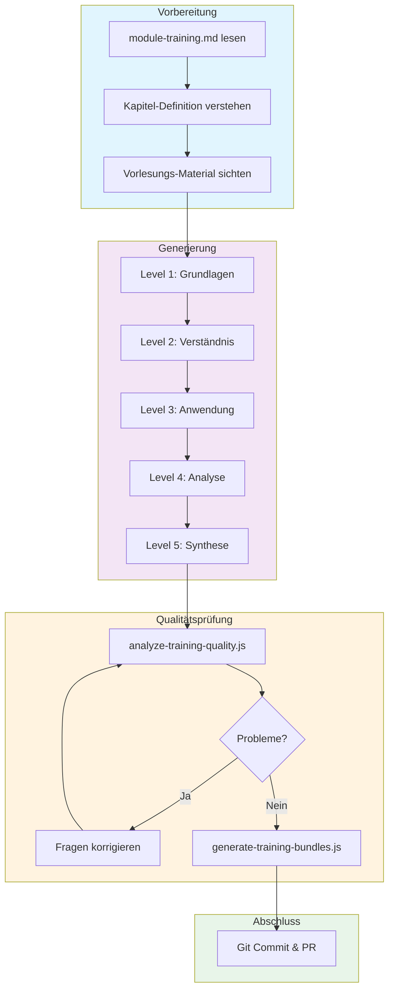

# Module Training Development

Anleitung zur Erstellung von Modul-Training-Fragen für den Casual Training Mode.

## Übersicht

Das Modul-Training bietet level-basiertes Üben unabhängig von Vorlesungen. Studierende können Themengebiete in 5 Schwierigkeitsstufen trainieren.

### Struktur

```text
content/{studyId}/{moduleId}/module-training/
├── training.md                              # Metadaten
├── training-bundle.json                     # Auto-generiert
├── 01-kapitel-name/
│   ├── level-1.yaml                        # 10 Grundlagen-Fragen
│   ├── level-2.yaml                        # 10 Verständnis-Fragen
│   ├── level-3.yaml                        # 10 Anwendungs-Fragen
│   ├── level-4.yaml                        # 10 Analyse-Fragen
│   └── level-5.yaml                        # 10 Synthese-Fragen
├── 02-kapitel-name/
│   └── ...
└── ...
```

### Kapazität pro Modul

| Eigenschaft          | Wert           |
| -------------------- | -------------- |
| Kapitel              | 15             |
| Level pro Kapitel    | 5              |
| Fragen pro Level     | 10             |
| **Gesamt pro Modul** | **750 Fragen** |

## Workflow



## YAML-Format

### Level 1-5 Datei

```yaml
# level-1.yaml
topic: 'Aufbau der Atome & Periodensystem'
level: 1
questions:
  - question: 'Aus welchen drei Teilchenarten besteht ein Atom?'
    options:
      - 'Aus Photonen, Neutronen und Elektronen'
      - 'Aus Protonen, Neutronen und Elektronen'
      - 'Aus Positronen, Neutronen und Protonen'
      - 'Aus Quarks, Leptonen und Bosonen'
      - 'Aus Molekülen, Ionen und Radikalen'
    correct: [1]  # 0-basiert: B ist korrekt

  - question: 'Wo befinden sich die positiv geladenen Kernteilchen?'
    options:
      - 'In der äußersten Schale der Hülle'
      - 'Gleichmäßig im Teilchen verteilt'
      - 'Im Zentrum zusammen mit Neutronen'
      - 'Zwischen Zentrum und Elektronenhülle'
      - 'Außerhalb der Elektronenwolke'
    correct: [2]  # C ist korrekt
```

### Multiple Correct (Level 2-5)

```yaml
  - question: 'Welche Aussagen über Isotope sind korrekt?'
    options:
      - 'Isotope haben die gleiche Anzahl an Protonen'
      - 'Isotope haben unterschiedliche Neutronenzahlen'
      - 'Isotope haben verschiedene Ordnungszahlen'
      - 'Isotope zeigen identische chemische Eigenschaften'
      - 'Isotope besitzen unterschiedliche Massenzahlen'
    correct: [0, 1, 4]  # A, B, E sind korrekt
```

## Level-Definitionen

| Level | Typ         | Kognitive Stufe            | Korrekte Antworten |
| ----- | ----------- | -------------------------- | ------------------ |
| 1     | Grundlagen  | Wissen abrufen             | Immer 1            |
| 2     | Verständnis | Zusammenhänge erkennen     | 1-2                |
| 3     | Anwendung   | Konzepte anwenden          | 1-2                |
| 4     | Analyse     | Komplexe Probleme lösen    | 1-3                |
| 5     | Synthese    | Transfer auf neue Kontexte | 2-3                |

## Qualitätsregeln

### ❌ VERBOTEN

| Regel                        | Beispiel                                        | Problem          |
| ---------------------------- | ----------------------------------------------- | ---------------- |
| Meta-Optionen                | "Alle genannten sind korrekt"                   | Verrät Muster    |
| Negativ-Fragen               | "Was ist NICHT korrekt?"                        | Verwirrend       |
| Frage-Keywords in Antwort    | Frage: "Perioden?" → Antwort: "Sieben Perioden" | Verrät Lösung    |
| Längste = Korrekt            | Korrekte Antwort hat 60 Zeichen, falsche 30     | Muster erkennbar |
| Absolute Begriffe nur falsch | "immer", "niemals", "alle" nur in Distraktoren  | Verrät Lösung    |

### ✅ ERFORDERLICH

| Regel                   | Zielwert                            |
| ----------------------- | ----------------------------------- |
| Antwortmöglichkeiten    | Genau 5 (A-E)                       |
| Zeichenlänge pro Option | 35-55 Zeichen                       |
| Längenvarianz           | Max. ±15 Zeichen                    |
| Positions-Verteilung    | 2× pro Position (A-E) bei 10 Fragen |
| Synonym-Nutzung         | Frage-Keywords umschreiben          |

### Synonym-Beispiele

| Frage-Keyword  | Synonyme für Antwort                 |
| -------------- | ------------------------------------ |
| Atom           | Teilchen, kleinste Einheit           |
| Periodensystem | Elementtafel, Anordnung der Elemente |
| Protonen       | Positiv geladene Kernteilchen        |
| Elektronen     | Negativ geladene Hüllteilchen        |
| Gruppe         | Spalte, Hauptgruppe                  |
| Periode        | Reihe, Zeile                         |

## Befehle

### Qualitätsprüfung

```bash
node scripts/analyze-training-quality.js
```

**Ausgabe-Interpretation:**

| Symbol | Bedeutung | Aktion                |
| ------ | --------- | --------------------- |
| 🔴      | Kritisch  | MUSS behoben werden   |
| 🟠      | Hoch      | SOLLTE geprüft werden |
| 🟡      | Mittel    | KANN ignoriert werden |
| ✅      | OK        | Keine Aktion nötig    |

### Bundle generieren

```bash
node scripts/generate-training-bundles.js [studyId]

# Beispiel:
node scripts/generate-training-bundles.js bsc-ernaehrungswissenschaften
```

## Checkliste vor Commit

```text
[ ] 10 Fragen pro Level
[ ] 5 Antwortmöglichkeiten pro Frage
[ ] Korrekte Anzahl korrekter Antworten (Level-abhängig)
[ ] analyze-training-quality.js: 0 kritische/hohe Probleme
[ ] Längen-Balance: < 1.15x
[ ] Positions-Verteilung: Alle A-E vertreten
[ ] generate-training-bundles.js erfolgreich
[ ] training-bundle.json aktualisiert
```

## Kapitel-Definitionen

Die Kapitel-Definitionen befinden sich in:

```text
studies-material/{studyId}/{moduleId}/module-training.md
```

Diese Datei enthält:
- Keywords pro Kapitel
- Kernkonzepte
- Ordner-Namenskonvention

## Beispiel: Vollständiger Generierungs-Prompt

```text
Generiere Modul-Training-Fragen für Modul 2 (Chemie), Kapitel 1, Level 1
```

**Copilot macht automatisch:**
1. Liest `studies-material/.../module-training.md`
2. Identifiziert Kapitel und Keywords
3. Generiert 10 Fragen im YAML-Format
4. Prüft Qualität mit `analyze-training-quality.js`
5. Korrigiert falls nötig
6. Speichert in `content/.../module-training/01-kapitel/level-1.yaml`

## Siehe auch

- [CONTENT_DEVELOPMENT.md](CONTENT_DEVELOPMENT.md) – Allgemeine Content-Entwicklung
- [CONTENT_TEMPLATES.md](CONTENT_TEMPLATES.md) – YAML-Templates
- [.github/copilot/module-training.md](../.github/copilot/module-training.md) – Copilot-Instruktionen
