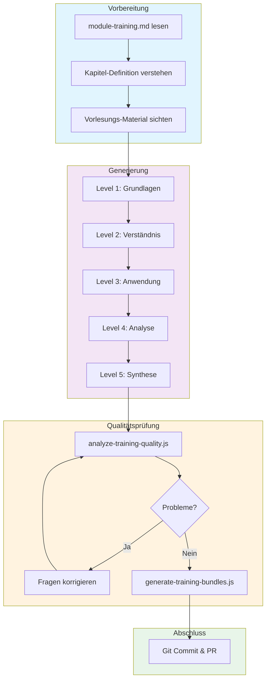
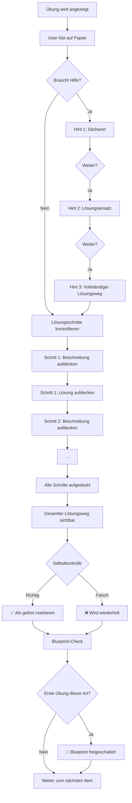

# Module Training Development

Anleitung zur Erstellung von Modul-Training-Inhalten für den Casual Training Mode.

## Übersicht

Das Modul-Training bietet level-basiertes Üben unabhängig von Vorlesungen. Studierende können Themengebiete in 5 Schwierigkeitsstufen trainieren.

### Inhaltstypen

1. **Multiple-Choice-Fragen** – Automatisch bewertete Wissensfragen
2. **Praktische Übungen** – Berechnungsaufgaben mit Selbstkontrolle
3. **Blueprints** – Lösungsweg-Templates als Achievement

### Struktur

```text
content/{studyId}/{moduleId}/module-training/
├── training.md                              # Metadaten
├── training-bundle.json                     # Auto-generiert
├── 01-kapitel-name/
│   ├── level-1.yaml                        # 10 Grundlagen-Fragen
│   ├── level-2.yaml                        # 10 Verständnis-Fragen
│   ├── level-3.yaml                        # 10 Anwendungs-Fragen
│   ├── level-4.yaml                        # 10 Analyse-Fragen
│   ├── level-5.yaml                        # 10 Synthese-Fragen
│   └── exercises.yaml                      # Praktische Übungen (optional)
├── 02-kapitel-name/
│   └── ...
└── ...
```

### Kapazität pro Modul

| Eigenschaft          | Wert           |
| -------------------- | -------------- |
| Kapitel              | 15             |
| Level pro Kapitel    | 5              |
| MC-Fragen pro Level  | 10             |
| **MC-Fragen gesamt** | **750**        |
| Praktische Übungen   | bis zu 10/Kap. |
| Blueprints           | ~10            |

## Workflow: MC-Fragen



## Workflow: Praktische Übungen



### Kapitel mit Übungen

| Kapitel | Name                        | Übungen | Begründung                   |
| ------- | --------------------------- | ------- | ---------------------------- |
| 01      | Aufbau Atome & PSE          | ❌       | Faktenwissen, keine Rechnung |
| 02      | Elemente, Ionen & Mol       | ✅ 10    | Mol-Berechnungen             |
| 03      | Gleichungen & Stöchiometrie | ✅ 5     | Kernthema für Berechnungen   |
| 04      | Reaktionen & Formeln        | ✅ 10    | Empirische Formeln, Redox    |
| 05      | Lösungen & Konzentrationen  | ✅ 10    | Verdünnungsrechnungen        |
| 06      | Säuren & Basen (Grundlagen) | ❌       | Einfache Konzepte            |
| 07      | Bohr & Elektronenkonfig.    | ❌       | Konfigurationen schreiben    |
| 08      | Ionenbindung & Lewis        | ❌       | Lewis-Strukturen             |
| 09      | Polarität & VSEPR           | ❌       | Geometrie bestimmen          |
| 10      | Hybridisierung & MO         | ❌       | Bindungsordnung              |
| 11      | Thermodynamik & Enthalpie   | ✅ 10    | Hess, Enthalpie-Berechnungen |
| 12      | Aggregatzustände & Phasen   | ❌       | Phasendiagramme              |
| 13      | Kolligative Eigenschaften   | ✅ 10    | Berechnungen ΔT, Osmose      |
| 14      | Säuren & Basen (Fortg.)     | ✅ 10    | pH, pKs, Puffer              |
| 15      | Elektrochemie & Redox       | ✅ 10    | Nernst, Faraday              |

## YAML-Format: MC-Fragen

### Level 1-5 Datei

```yaml
# level-1.yaml
topic: 'Aufbau der Atome & Periodensystem'
level: 1
questions:
  - question: 'Aus welchen drei Teilchenarten besteht ein Atom?'
    options:
      - 'Aus Photonen, Neutronen und Elektronen'
      - 'Aus Protonen, Neutronen und Elektronen'
      - 'Aus Positronen, Neutronen und Protonen'
      - 'Aus Quarks, Leptonen und Bosonen'
      - 'Aus Molekülen, Ionen und Radikalen'
    correct: [1]  # 0-basiert: B ist korrekt

  - question: 'Wo befinden sich die positiv geladenen Kernteilchen?'
    options:
      - 'In der äußersten Schale der Hülle'
      - 'Gleichmäßig im Teilchen verteilt'
      - 'Im Zentrum zusammen mit Neutronen'
      - 'Zwischen Zentrum und Elektronenhülle'
      - 'Außerhalb der Elektronenwolke'
    correct: [2]  # C ist korrekt
```

### Multiple Correct (Level 2-5)

```yaml
  - question: 'Welche Aussagen über Isotope sind korrekt?'
    options:
      - 'Isotope haben die gleiche Anzahl an Protonen'
      - 'Isotope haben unterschiedliche Neutronenzahlen'
      - 'Isotope haben verschiedene Ordnungszahlen'
      - 'Isotope zeigen identische chemische Eigenschaften'
      - 'Isotope besitzen unterschiedliche Massenzahlen'
    correct: [0, 1, 4]  # A, B, E sind korrekt
```

## YAML-Format: Praktische Übungen

```yaml
# exercises.yaml
topic: 'Chemische Gleichungen & Stöchiometrie'
blueprintType: 'stoichiometry-calculation'
exercises:
  - id: 'ex-03-01'
    title: 'Verbrennung von Kohlenstoff'
    level: 3
    
    task: |
      Bei der vollständigen Verbrennung von 12,0 g Kohlenstoff
      mit Sauerstoff entsteht Kohlendioxid.
      
      Berechne:
      a) Die Stoffmenge an Kohlenstoff
      b) Die benötigte Masse an Sauerstoff
      c) Die entstehende Masse an CO₂
    
    hints:
      keyword: 'Stoffmengenverhältnis aus Reaktionsgleichung'
      approach: |
        1. Reaktionsgleichung aufstellen
        2. Stoffmengen über n = m/M berechnen
        3. Stöchiometrische Verhältnisse anwenden
      overview: |
        - Reaktionsgleichung: C + O₂ → CO₂
        - n(C) = 1,0 mol
        - n(O₂) = 1,0 mol → m(O₂) = 32,0 g
    
    steps:
      - description: 'Reaktionsgleichung aufstellen'
        solution: 'C + O₂ → CO₂'
      - description: 'Stoffmenge von Kohlenstoff berechnen'
        solution: 'n(C) = 12,0 g / 12,0 g/mol = 1,0 mol'
      - description: 'Masse CO₂ berechnen'
        solution: 'm(CO₂) = 1,0 mol × 44,0 g/mol = 44,0 g'
    
    finalAnswer: |
      a) n(C) = 1,0 mol
      b) m(O₂) = 32,0 g
      c) m(CO₂) = 44,0 g
    
    relatedBlueprints:
      - 'stoichiometry-calculation-blueprint'
```

### Übungs-Level-Definitionen

| Level | Komplexität   | Schritte | Beispiel                             |
| ----- | ------------- | -------- | ------------------------------------ |
| 1     | Grundlegend   | 2-3      | Einfache n=m/M Berechnung            |
| 2     | Einfach       | 3-4      | Mol-Berechnung mit Umrechnung        |
| 3     | Mittel        | 4-5      | Stöchiometrie mit Reaktionsgleichung |
| 4     | Komplex       | 5-7      | Mehrstufige Reaktion, Ausbeute       |
| 5     | Anspruchsvoll | 6-8+     | Transfer, unbekannte Kontexte        |

## Blueprints

Blueprints sind detaillierte Anleitungen für bestimmte Aufgabentypen:

| Blueprint-ID                              | Titel                   | Freigeschaltet durch      |
| ----------------------------------------- | ----------------------- | ------------------------- |
| `mol-calculation-blueprint`               | Mol-Berechnungen        | Erste Mol-Übung gelöst    |
| `stoichiometry-calculation-blueprint`     | Stöchiometrie           | Erste Stöchiometrie-Übung |
| `concentration-calculation-blueprint`     | Konzentrationen         | Erste Verdünnungs-Übung   |
| `empirical-formula-calculation-blueprint` | Empirische Formeln      | Erste Formel-Übung        |
| `thermodynamics-calculation-blueprint`    | Thermodynamik           | Erste Hess-Übung          |
| `colligative-calculation-blueprint`       | Kolligative Eig.        | Erste Osmose-Übung        |
| `acid-base-calculation-blueprint`         | Säure-Base              | Erste pH-Übung            |
| `electrochemistry-calculation-blueprint`  | Elektrochemie           | Erste Nernst-Übung        |
| `lewis-structure-blueprint`               | Lewis-Strukturen        | Erste Lewis-Übung         |
| `electron-configuration-blueprint`        | Elektronenkonfiguration | Erste Konfig-Übung        |

## Level-Definitionen (MC)

| Level | Typ         | Kognitive Stufe            | Korrekte Antworten |
| ----- | ----------- | -------------------------- | ------------------ |
| 1     | Grundlagen  | Wissen abrufen             | Immer 1            |
| 2     | Verständnis | Zusammenhänge erkennen     | 1-2                |
| 3     | Anwendung   | Konzepte anwenden          | 1-2                |
| 4     | Analyse     | Komplexe Probleme lösen    | 1-3                |
| 5     | Synthese    | Transfer auf neue Kontexte | 2-3                |

## Qualitätsregeln

### ❌ VERBOTEN

| Regel                        | Beispiel                                        | Problem          |
| ---------------------------- | ----------------------------------------------- | ---------------- |
| Meta-Optionen                | "Alle genannten sind korrekt"                   | Verrät Muster    |
| Negativ-Fragen               | "Was ist NICHT korrekt?"                        | Verwirrend       |
| Frage-Keywords in Antwort    | Frage: "Perioden?" → Antwort: "Sieben Perioden" | Verrät Lösung    |
| Längste = Korrekt            | Korrekte Antwort hat 60 Zeichen, falsche 30     | Muster erkennbar |
| Absolute Begriffe nur falsch | "immer", "niemals", "alle" nur in Distraktoren  | Verrät Lösung    |

### ✅ ERFORDERLICH

| Regel                   | Zielwert                            |
| ----------------------- | ----------------------------------- |
| Antwortmöglichkeiten    | Genau 5 (A-E)                       |
| Zeichenlänge pro Option | 35-55 Zeichen                       |
| Längenvarianz           | Max. ±15 Zeichen                    |
| Positions-Verteilung    | 2× pro Position (A-E) bei 10 Fragen |
| Synonym-Nutzung         | Frage-Keywords umschreiben          |

### Synonym-Beispiele

| Frage-Keyword  | Synonyme für Antwort                 |
| -------------- | ------------------------------------ |
| Atom           | Teilchen, kleinste Einheit           |
| Periodensystem | Elementtafel, Anordnung der Elemente |
| Protonen       | Positiv geladene Kernteilchen        |
| Elektronen     | Negativ geladene Hüllteilchen        |
| Gruppe         | Spalte, Hauptgruppe                  |
| Periode        | Reihe, Zeile                         |

## Befehle

### Qualitätsprüfung

```bash
node scripts/analyze-training-quality.js
```

**Ausgabe-Interpretation:**

| Symbol | Bedeutung | Aktion                |
| ------ | --------- | --------------------- |
| 🔴      | Kritisch  | MUSS behoben werden   |
| 🟠      | Hoch      | SOLLTE geprüft werden |
| 🟡      | Mittel    | KANN ignoriert werden |
| ✅      | OK        | Keine Aktion nötig    |

### Bundle generieren

```bash
node scripts/generate-training-bundles.js [studyId]

# Beispiel:
node scripts/generate-training-bundles.js bsc-ernaehrungswissenschaften
```

## Checkliste vor Commit

```text
[ ] 10 Fragen pro Level
[ ] 5 Antwortmöglichkeiten pro Frage
[ ] Korrekte Anzahl korrekter Antworten (Level-abhängig)
[ ] analyze-training-quality.js: 0 kritische/hohe Probleme
[ ] Längen-Balance: < 1.15x
[ ] Positions-Verteilung: Alle A-E vertreten
[ ] generate-training-bundles.js erfolgreich
[ ] training-bundle.json aktualisiert
```

### Praktische Übungen

```text
[ ] Alle Pflichtfelder (id, title, level, task, hints, steps, finalAnswer)
[ ] Schritte sind logisch aufgebaut
[ ] Hints bauen aufeinander auf (keyword → approach → overview)
[ ] Realistische Werte und Größenordnungen
[ ] blueprintType verknüpft passenden Blueprint
[ ] generate-training-bundles.js erfolgreich
[ ] generate-test-progress.js ausgeführt
```

## Trainings-Modus-Einstellungen

Nutzer können wählen zwischen:

- **Nur MC-Fragen** – Klassisches Quiz-Format
- **Nur Übungen** – Fokus auf Berechnungen
- **Beides** (Standard) – Gemischtes Training

Die Einstellung wird in localStorage persistiert.

## Kapitel-Definitionen

Die Kapitel-Definitionen befinden sich in:

```text
studies-material/{studyId}/{moduleId}/module-training.md
```

Diese Datei enthält:
- Keywords pro Kapitel
- Kernkonzepte
- Ordner-Namenskonvention

## Beispiel: Vollständiger Generierungs-Prompt

```text
Generiere Modul-Training-Fragen für Modul 2 (Chemie), Kapitel 1, Level 1
```

**Copilot macht automatisch:**
1. Liest `studies-material/.../module-training.md`
2. Identifiziert Kapitel und Keywords
3. Generiert 10 Fragen im YAML-Format
4. Prüft Qualität mit `analyze-training-quality.js`
5. Korrigiert falls nötig
6. Speichert in `content/.../module-training/01-kapitel/level-1.yaml`

## Siehe auch

- [CONTENT_DEVELOPMENT.md](CONTENT_DEVELOPMENT.md) – Allgemeine Content-Entwicklung
- [CONTENT_TEMPLATES.md](CONTENT_TEMPLATES.md) – YAML-Templates
- [ACHIEVEMENT_SYSTEM.md](ACHIEVEMENT_SYSTEM.md) – Achievement-System inkl. Blueprints
- [.github/copilot/module-training.md](../.github/copilot/module-training.md) – Copilot-Instruktionen
